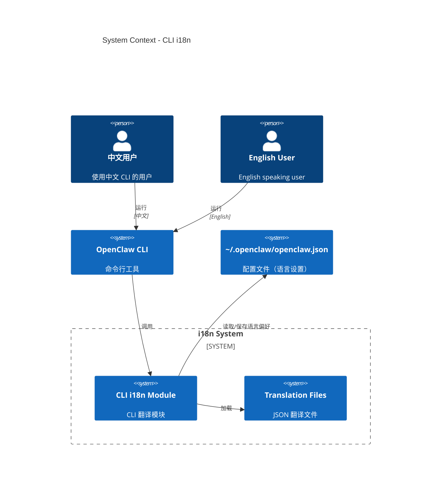

# Level 1: System Context - CLI 国际化

## 上下文图



## 用户故事

### 中文用户使用 CLI

1. 用户首次运行 `openclaw` 命令
2. CLI 检测系统语言为中文
3. 自动显示中文帮助信息
4. 用户可以运行 `openclaw config set language en` 切换到英文

### 英文用户使用 CLI

1. 用户运行 `openclaw gateway start`
2. 显示英文输出
3. 所有提示和错误信息都是英文

## 关键设计决策

### 1. 语言检测优先级

```
优先级从高到低：
1. 命令行参数: --lang zh
2. 环境变量: OPENCLAW_LANG=zh
3. 配置文件: ~/.openclaw/openclaw.json -> language
4. 系统语言检测: process.env.LANG / locale
5. 默认: en
```

### 2. 翻译文件加载策略

```
- 启动时加载：只加载当前语言的翻译文件
- 懒加载：如果切换语言，动态加载新的翻译文件
- 缓存：已加载的翻译文件缓存在内存中
- 文件位置：src/cli/i18n/locales/*.json
```

### 3. 与 Commander.js 集成

```typescript
// 方案：包装 Commander 的 description 和 option
program
  .name(t("program.name"))
  .description(t("program.description"))
  .version(t("program.version"))
  .option("-l, --lang <lang>", t("options.lang"));
```

## 外部依赖

| 组件            | 用途         | 接口                          |
| --------------- | ------------ | ----------------------------- |
| Node.js process | 语言环境检测 | `process.env.LANG`            |
| fs module       | 读取翻译文件 | `fs.readFileSync`             |
| Commander.js    | CLI 框架     | `.description()`, `.option()` |

## 约束与挑战

1. **性能**: CLI 启动必须快，翻译文件不能太大
2. **向后兼容**: 现有脚本和自动化不能受影响
3. **测试**: 需要测试不同语言环境下的行为
4. **维护**: 新命令添加时需要同步添加翻译

## 参考

- [Commander.js 文档](https://github.com/tj/commander.js/)
- [Node.js 国际化最佳实践](https://nodejs.org/api/intl.html)
- [GNU gettext](https://www.gnu.org/software/gettext/)
