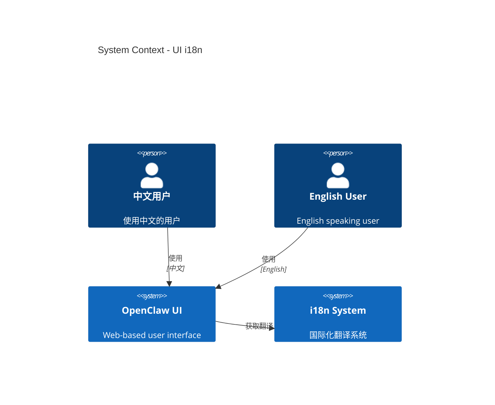

# Level 1: System Context - UI 国际化

## 上下文图

## 用户故事

### 中文用户

1. 用户访问 OpenClaw UI
2. 浏览器自动检测语言为中文
3. UI 自动显示中文界面
4. 用户可以手动切换到其他语言

### 英文用户

1. 用户访问 OpenClaw UI
2. 浏览器语言为英文
3. UI 显示英文界面（默认）

## 外部依赖

| 系统     | 用途           | 接口                 |
| -------- | -------------- | -------------------- |
| 浏览器   | 语言检测       | `navigator.language` |
| 本地存储 | 语言偏好持久化 | `localStorage`       |

## 关键约束

1. **性能**: 翻译文件按需加载，不阻塞 UI 渲染
2. **兼容性**: 支持所有现代浏览器
3. **可维护性**: 翻译键名清晰，便于管理
