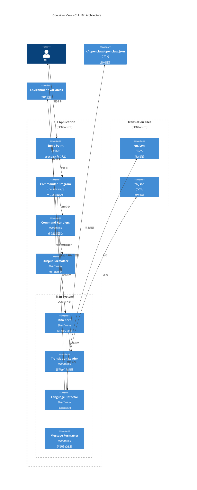

# Level 2: Container View - CLI 国际化

## 容器图



## 容器列表

| 容器               | 技术         | 职责                         |
| ------------------ | ------------ | ---------------------------- |
| Entry Point        | Node.js      | CLI 入口，参数解析启动       |
| Commander Program  | Commander.js | 命令注册、参数解析、帮助生成 |
| I18n Core          | TypeScript   | 核心翻译 API，管理当前语言   |
| Translation Loader | TypeScript   | 从 JSON 文件加载翻译         |
| Language Detector  | TypeScript   | 检测用户首选语言             |
| Message Formatter  | TypeScript   | 格式化带变量的消息           |
| Command Handlers   | TypeScript   | 执行具体命令逻辑             |
| Output Formatter   | TypeScript   | 格式化命令输出               |

## 关键技术决策

### 1. 初始化时序

```
1. Node.js 启动
        │
        ▼
2. 加载 Entry Point (bin/openclaw)
        │
        ▼
3. 创建 Commander Program
        │
        ├── 注册命令 (此时命令描述还未翻译)
        │
        └── 解析命令行参数
        │
        ▼
4. 初始化 i18n System
        │
        ├── 检测语言 (CLI参数 > 环境变量 > 配置文件 > 系统语言)
        │
        └── 加载对应翻译文件
        │
        ▼
5. 重新设置命令描述（如果语言不是英文）
        │
        ▼
6. 执行命令
        │
        └── 所有输出通过 i18n.t() 翻译
```

### 2. 语言检测优先级

```typescript
// src/cli/i18n/detector.ts
function detectLanguage(cliOptions: CLIOptions): string {
  // 1. CLI 参数: --lang zh
  if (cliOptions.lang) {
    return normalizeLang(cliOptions.lang);
  }

  // 2. 环境变量: OPENCLAW_LANG=zh
  if (process.env.OPENCLAW_LANG) {
    return normalizeLang(process.env.OPENCLAW_LANG);
  }

  // 3. 配置文件: ~/.openclaw/openclaw.json -> language
  const config = loadConfig();
  if (config.language) {
    return normalizeLang(config.language);
  }

  // 4. 系统语言: process.env.LANG or Intl.DateTimeFormat
  const systemLang = process.env.LANG || Intl.DateTimeFormat().resolvedOptions().locale;
  if (systemLang) {
    return normalizeLang(systemLang);
  }

  // 5. 默认: 英文
  return "en";
}
```

### 3. 与 Commander.js 集成方案

#### 方案 A: 运行时重新注册（推荐）

```typescript
// src/cli/i18n/commander-integration.ts
import { Command } from "commander";
import { i18n } from "./core";

export function translateCommander(program: Command): void {
  // 翻译程序描述
  if (program.description()) {
    program.description(i18n.t(`commands.${program.name()}.description`));
  }

  // 递归翻译子命令
  program.commands.forEach((cmd) => {
    translateCommand(cmd);
  });
}

function translateCommand(cmd: Command): void {
  const commandPath = getCommandPath(cmd);

  // 翻译描述
  const descKey = `commands.${commandPath}.description`;
  if (i18n.exists(descKey)) {
    cmd.description(i18n.t(descKey));
  }

  // 翻译选项
  cmd.options.forEach((opt) => {
    const optKey = `commands.${commandPath}.options.${opt.attributeName()}`;
    if (i18n.exists(optKey)) {
      // 需要访问 Commander 内部或重新创建选项
      opt.description = i18n.t(optKey);
    }
  });

  // 递归子命令
  cmd.commands.forEach((subCmd) => {
    translateCommand(subCmd);
  });
}

function getCommandPath(cmd: Command): string {
  const parts: string[] = [];
  let current: Command | null = cmd;
  while (current) {
    if (current.name()) {
      parts.unshift(current.name());
    }
    // @ts-ignore - 访问父命令
    current = current.parent;
  }
  return parts.join(".");
}
```

#### 方案 B: 工厂模式创建命令

```typescript
// src/cli/i18n/command-factory.ts
import { Command } from "commander";
import { i18n } from "./core";

interface CommandConfig {
  name: string;
  descriptionKey: string;
  action: (...args: any[]) => void | Promise<void>;
  options?: Array<{
    flags: string;
    descriptionKey: string;
    defaultValue?: any;
  }>;
  subcommands?: CommandConfig[];
}

export function createCommand(config: CommandConfig): Command {
  const cmd = new Command(config.name);

  // 使用当前语言翻译
  cmd.description(i18n.t(config.descriptionKey));
  cmd.action(config.action);

  // 添加选项
  config.options?.forEach((opt) => {
    cmd.option(opt.flags, i18n.t(opt.descriptionKey), opt.defaultValue);
  });

  // 递归添加子命令
  config.subcommands?.forEach((sub) => {
    cmd.addCommand(createCommand(sub));
  });

  return cmd;
}

// 使用示例
const gatewayConfig: CommandConfig = {
  name: "gateway",
  descriptionKey: "commands.gateway.description",
  action: async () => {
    /* ... */
  },
  subcommands: [
    {
      name: "start",
      descriptionKey: "commands.gateway.subcommands.start.description",
      action: async () => {
        /* ... */
      },
      options: [
        {
          flags: "-p, --port <port>",
          descriptionKey: "commands.gateway.subcommands.start.options.port",
        },
      ],
    },
  ],
};
```

### 4. 输出消息翻译

```typescript
// src/cli/i18n/output.ts
import { i18n } from "./core";

// 替代 console.log
export function log(messageKey: string, params?: Record<string, string>): void {
  const message = i18n.t(messageKey, params);
  console.log(message);
}

export function error(messageKey: string, params?: Record<string, string>): void {
  const message = i18n.t(messageKey, params);
  console.error(message);
}

export function success(messageKey: string, params?: Record<string, string>): void {
  const message = "✓ " + i18n.t(messageKey, params);
  console.log(message);
}

export function info(messageKey: string, params?: Record<string, string>): void {
  const message = "ℹ " + i18n.t(messageKey, params);
  console.log(message);
}

export function warning(messageKey: string, params?: Record<string, string>): void {
  const message = "⚠ " + i18n.t(messageKey, params);
  console.warn(message);
}
```

## 实现路线图

### 阶段 1: 基础 i18n 框架

- [ ] 创建 i18n 核心模块
- [ ] 实现翻译文件加载器
- [ ] 实现语言检测器
- [ ] 创建基础翻译文件（en + zh）

### 阶段 2: Commander 集成

- [ ] 实现命令翻译包装器
- [ ] 更新所有命令注册代码
- [ ] 翻译所有命令描述和选项

### 阶段 3: 输出消息

- [ ] 替换所有 console.log 为 i18n 输出函数
- [ ] 翻译所有错误消息
- [ ] 翻译所有成功/提示消息

### 阶段 4: 完善

- [ ] 添加语言切换命令
- [ ] 完善中文翻译
- [ ] 添加更多语言支持
- [ ] 编写 i18n 文档

## 参考

- [Commander.js](https://github.com/tj/commander.js/)
- [i18next](https://www.i18next.com/)
- [Intl.DisplayNames](https://developer.mozilla.org/en-US/docs/Web/JavaScript/Reference/Global_Objects/Intl/DisplayNames)
