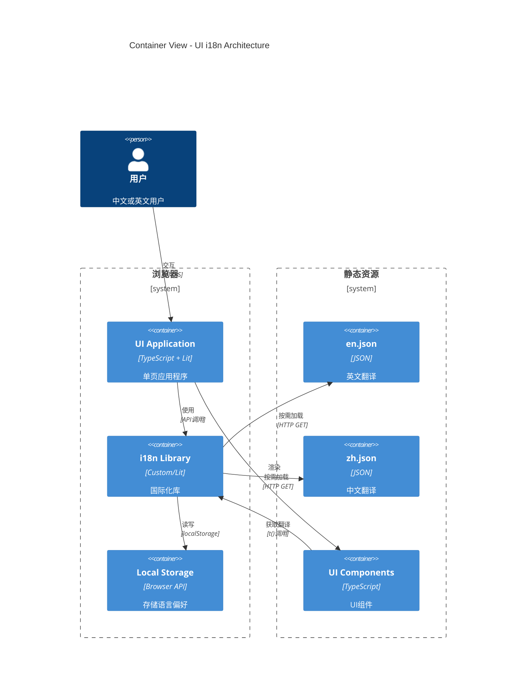

# Level 2: Container View - UI 国际化

## 容器图



## 容器列表

| 容器           | 技术                 | 职责                     |
| -------------- | -------------------- | ------------------------ |
| UI Application | TypeScript + Lit     | 主应用，管理路由和状态   |
| i18n Library   | 自定义或 lit-i18n    | 翻译加载、插值、语言切换 |
| Local Storage  | Browser localStorage | 持久化用户语言偏好       |
| en.json        | JSON                 | 英文翻译文件             |
| zh.json        | JSON                 | 中文翻译文件             |
| UI Components  | TypeScript + Lit     | 可复用的界面组件         |

## 关键技术决策

### 1. i18n 库选择

**方案 A: 自定义实现**

```typescript
// i18n.ts
class I18n {
  private translations: Record<string, string> = {};
  private currentLang = "en";

  async loadLanguage(lang: string) {
    const response = await fetch(`/i18n/${lang}.json`);
    this.translations = await response.json();
    this.currentLang = lang;
    localStorage.setItem("i18n-lang", lang);
  }

  t(key: string, params?: Record<string, string>): string {
    let text = this.translations[key] || key;
    if (params) {
      Object.entries(params).forEach(([k, v]) => {
        text = text.replace(`{{${k}}}`, v);
      });
    }
    return text;
  }
}

export const i18n = new I18n();
```

**方案 B: 使用 lit-i18n**

```bash
npm install @lit/localize
```

**决策**: 方案 A（自定义），理由：

- 轻量级，不需要额外依赖
- 完全可控，符合项目风格
- 学习成本低

### 2. 翻译文件结构

```
ui/public/i18n/
├── en.json           # 英文（默认）
├── zh.json           # 中文简体
└── zh-TW.json        # 中文繁体（未来）
```

### 3. 语言检测策略

```typescript
// 初始化时检测语言
function detectLanguage(): string {
  // 1. 检查 localStorage 中保存的偏好
  const saved = localStorage.getItem("i18n-lang");
  if (saved) return saved;

  // 2. 检查浏览器语言
  const browserLang = navigator.language.toLowerCase();
  if (browserLang.startsWith("zh")) return "zh";

  // 3. 默认英文
  return "en";
}
```

## 部署架构

```
┌─────────────────┐
│  Gateway Server │
│  (Node.js)      │
│                 │
│  ┌───────────┐  │
│  │  UI SPA   │  │ ← 静态资源
│  │  /ui/*    │  │
│  └───────────┘  │
│                 │
│  ┌───────────┐  │
│  │ i18n JSON │  │ ← 翻译文件
│  │ /i18n/*   │  │
│  └───────────┘  │
│                 │
│  ┌───────────┐  │
│  │  WS API   │  │
│  └───────────┘  │
└─────────────────┘
```
