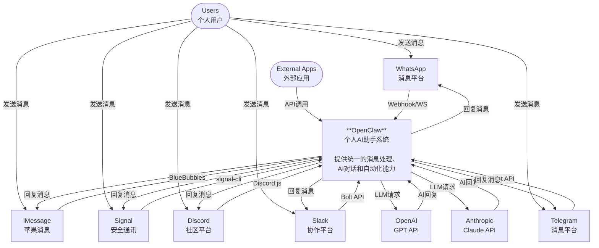

# OpenClaw C4 Model - Level 1: System Context

## 系统上下文图

## 图表说明

### 核心系统
- **OpenClaw**: 个人AI助手系统，作为中央网关，整合多个消息平台，提供AI对话能力

### 外部系统 - 消息平台 (Channels)
- **WhatsApp**: 通过 Baileys 库连接
- **Telegram**: 通过 grammY 库连接
- **Slack**: 通过 Bolt API 连接
- **Discord**: 通过 discord.js 连接
- **Signal**: 通过 signal-cli 连接
- **iMessage**: 通过 BlueBubbles 连接

### 外部系统 - AI 模型
- **Anthropic Claude**: 主要推荐的 AI 模型
- **OpenAI GPT**: 备选 AI 模型

### 用户类型
- **个人用户**: 通过各类消息应用与 OpenClaw 交互
- **外部应用**: 通过 API 集成 OpenClaw 能力
