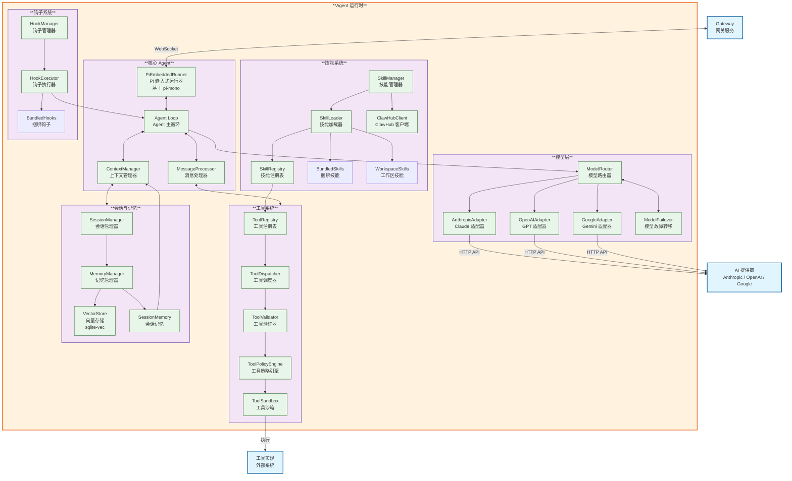

# OpenClaw C4 Model - Level 3: Agent Component Diagram

## Agent 运行时组件图

## 组件说明

### 核心 Agent
- **PiEmbeddedRunner**: 基于 pi-mono 的嵌入式运行器，Agent 的入口点
- **AgentLoop**: Agent 主循环，协调对话流程
- **MessageProcessor**: 处理传入消息，解析意图
- **ContextManager**: 管理对话上下文和历史

### 模型层
- **ModelRouter**: 智能路由到不同的 AI 提供商
- **AnthropicAdapter**: Claude API 适配器
- **OpenAIAdapter**: GPT API 适配器
- **GoogleAdapter**: Gemini API 适配器
- **ModelFailover**: 模型故障转移机制

### 工具系统
- **ToolRegistry**: 注册和管理可用工具
- **ToolDispatcher**: 调度工具执行
- **ToolValidator**: 验证工具参数
- **ToolPolicyEngine**: 工具策略引擎，控制权限
- **ToolSandbox**: 工具沙箱，隔离执行

### 技能系统
- **SkillManager**: 管理技能生命周期
- **SkillLoader**: 加载技能 (捆绑/工作区/ClawHub)
- **SkillRegistry**: 注册技能工具
- **ClawHubClient**: 连接 ClawHub 技能市场

### 会话与记忆
- **SessionManager**: 管理会话状态
- **MemoryManager**: 管理长期记忆
- **VectorStore**: 向量存储 (sqlite-vec)
- **SessionMemory**: 会话级记忆

### 钩子系统
- **HookManager**: 管理钩子生命周期
- **HookExecutor**: 执行钩子
- **BundledHooks**: 捆绑的钩子 (session-memory, command-logger 等)
