# OpenClaw C4 Model - Level 3: Android App Component Diagram

## Android App 组件图

```mermaid
flowchart TB
    %% External Systems
    OpenClawGateway["**OpenClaw Gateway**<br/>WebSocket Server<br/>端口: 18789"]
    LocalNetwork["**本地网络**<br/>mDNS/局域网发现"]
    AndroidOS["**Android OS**<br/>系统服务"]

    %% Android App Boundary
    subgraph AndroidApp["**Android App**<br/>OpenClaw 节点应用"]
        direction TB

        %% UI Layer
        subgraph UILayer["**UI 层**<br/>Jetpack Compose"]
            MainActivity["MainActivity<br/>主界面"]
            ChatScreen["ChatScreen<br/>聊天界面"]
            SettingsScreen["SettingsScreen<br/>设置界面"]
            NodeDiscoveryScreen["NodeDiscoveryScreen<br/>节点发现"]
            ConnectionStatus["ConnectionStatus<br/>连接状态组件"]
            MessageBubble["MessageBubble<br/>消息气泡"]
        end

        %% ViewModel Layer
        subgraph ViewModelLayer["**ViewModel 层**<br/>MVVM 架构"]
            MainViewModel["MainViewModel<br/>主视图模型"]
            ChatViewModel["ChatViewModel<br/>聊天视图模型"]
            SettingsViewModel["SettingsViewModel<br/>设置视图模型"]
            DiscoveryViewModel["DiscoveryViewModel<br/>发现视图模型"]
        end

        %% Service Layer
        subgraph ServiceLayer["**服务层**<br/>核心服务"]
            GatewayService["GatewayService<br/>网关服务"]
            DiscoveryService["DiscoveryService<br/>发现服务"]
            MessageService["MessageService<br/>消息服务"]
            ConnectionManager["ConnectionManager<br/>连接管理器"]
            NotificationService["NotificationService<br/>通知服务"]
            PreferenceService["PreferenceService<br/>偏好设置"]
        end

        %% Repository Layer
        subgraph RepositoryLayer["**Repository 层**<br/>数据仓库"]
            GatewayRepository["GatewayRepository<br/>网关仓库"]
            MessageRepository["MessageRepository<br/>消息仓库"]
            SettingsRepository["SettingsRepository<br/>设置仓库"]
            DiscoveryRepository["DiscoveryRepository<br/>发现仓库"]
        end

        %% Data Layer
        subgraph DataLayer["**数据层**<br/>本地存储"]
            RoomDB[("Room Database<br/>SQLite 数据库")]
            DataStore[("DataStore<br/>键值存储")]
            CacheManager["CacheManager<br/>缓存管理"]
        end

        %% Network Layer
        subgraph NetworkLayer["**网络层**<br/>通信模块"]
            WebSocketClient["WebSocketClient<br/>WebSocket 客户端"]
            ProtocolHandler["ProtocolHandler<br/>协议处理器"]
            MessageSerializer["MessageSerializer<br/>消息序列化"]
            NetworkMonitor["NetworkMonitor<br/>网络监控"]
            MDNSClient["mDNSClient<br/>mDNS 客户端"]
        end

        %% Utility Layer
        subgraph UtilityLayer["**工具层**<br/>辅助工具"]
            Logger["Logger<br/>日志记录"]
            SecurityUtil["SecurityUtil<br/>安全工具"]
            JsonUtil["JsonUtil<br/>JSON 工具"]
            CoroutineUtil["CoroutineUtil<br/>协程工具"]
        end
    end

    %% External Connections
    Users(["用户"])

    %% User to UI
    Users -->|交互| MainActivity
    Users -->|聊天| ChatScreen
    Users -->|设置| SettingsScreen

    %% UI to ViewModel
    MainActivity -->|状态订阅| MainViewModel
    ChatScreen -->|消息操作| ChatViewModel
    SettingsScreen -->|配置变更| SettingsViewModel
    NodeDiscoveryScreen -->|发现节点| DiscoveryViewModel

    %% ViewModel to Service
    MainViewModel -->|连接管理| GatewayService
    MainViewModel -->|状态查询| ConnectionManager
    ChatViewModel -->|发送消息| MessageService
    ChatViewModel -->|加载历史| MessageService
    SettingsViewModel -->|保存配置| PreferenceService
    DiscoveryViewModel -->|发现网关| DiscoveryService

    %% Service to Repository
    GatewayService -->|网关数据| GatewayRepository
    MessageService -->|消息数据| MessageRepository
    PreferenceService -->|偏好数据| SettingsRepository
    DiscoveryService -->|节点数据| DiscoveryRepository

    %% Repository to Data Layer
    GatewayRepository -->|查询/存储| RoomDB
    MessageRepository -->|查询/存储| RoomDB
    SettingsRepository -->|读取/写入| DataStore

    %% Service to Network Layer
    GatewayService <-->|WebSocket 连接| WebSocketClient
    ConnectionManager -->|监控状态| NetworkMonitor
    DiscoveryService -->|发现服务| MDNSClient
    MessageService -->|发送数据| ProtocolHandler

    %% Network Layer to External
    WebSocketClient <-->|WebSocket| OpenClawGateway
    MDNSClient <-->|mDNS 广播| LocalNetwork
    NetworkMonitor -->|状态监听| AndroidOS

    %% Protocol Handler flow
    ProtocolHandler -->|编码/解码| MessageSerializer
    MessageSerializer -->|JSON 转换| JsonUtil

    %% Notification
    NotificationService -->|发送通知| AndroidOS
    ChatViewModel -->|触发通知| NotificationService

    %% Utility usage
    GatewayService -->|记录日志| Logger
    SecurityUtil -->|加密存储| DataStore
    CoroutineUtil -->|异步操作| ViewModelLayer

    %% Data flow for messages
    RoomDB -->|历史消息| MessageRepository
    MessageRepository -->|加载| ChatViewModel
    ChatViewModel -->|展示| ChatScreen

    %% Connection status flow
    ConnectionManager -->|状态更新| MainViewModel
    MainViewModel -->|UI 更新| ConnectionStatus
```



## 组件说明

### UI 层 (Jetpack Compose)

| 组件                | 描述                                   |
| ------------------- | -------------------------------------- |
| MainActivity        | 应用主入口，承载主要导航结构           |
| ChatScreen          | 聊天界面，展示消息历史并支持发送新消息 |
| SettingsScreen      | 设置界面，配置网关连接和偏好设置       |
| NodeDiscoveryScreen | 节点发现界面，扫描和连接本地网关       |
| ConnectionStatus    | 连接状态组件，显示 WebSocket 连接状态  |
| MessageBubble       | 消息气泡组件，展示单条消息             |

### ViewModel 层 (MVVM 架构)

| 组件               | 描述                                   |
| ------------------ | -------------------------------------- |
| MainViewModel      | 主视图模型，管理连接状态和整体 UI 状态 |
| ChatViewModel      | 聊天视图模型，处理消息发送和接收逻辑   |
| SettingsViewModel  | 设置视图模型，管理配置变更和保存       |
| DiscoveryViewModel | 发现视图模型，处理网关发现流程         |

### 服务层

| 组件                | 描述                                   |
| ------------------- | -------------------------------------- |
| GatewayService      | 网关服务，管理 WebSocket 连接生命周期  |
| DiscoveryService    | 发现服务，通过 mDNS 扫描本地网关       |
| MessageService      | 消息服务，处理消息发送、接收和历史加载 |
| ConnectionManager   | 连接管理器，监控连接状态和健康检查     |
| NotificationService | 通知服务，发送系统通知提醒用户         |
| PreferenceService   | 偏好服务，管理用户设置和应用配置       |

### Repository 层

| 组件                | 描述                             |
| ------------------- | -------------------------------- |
| GatewayRepository   | 网关仓库，管理网关信息和状态数据 |
| MessageRepository   | 消息仓库，提供消息的增删改查操作 |
| SettingsRepository  | 设置仓库，管理配置数据的持久化   |
| DiscoveryRepository | 发现仓库，存储发现的节点信息     |

### 数据层

| 组件         | 描述                                        |
| ------------ | ------------------------------------------- |
| RoomDB       | SQLite 数据库，存储消息、网关信息和历史记录 |
| DataStore    | 键值存储，保存用户偏好设置和应用配置        |
| CacheManager | 缓存管理器，管理内存和磁盘缓存              |

### 网络层

| 组件              | 描述                                   |
| ----------------- | -------------------------------------- |
| WebSocketClient   | WebSocket 客户端，管理与网关的持久连接 |
| ProtocolHandler   | 协议处理器，处理 OpenClaw 协议消息格式 |
| MessageSerializer | 消息序列化器，JSON 编码和解码          |
| NetworkMonitor    | 网络监控器，监听网络状态变化           |
| mDNSClient        | mDNS 客户端，发现本地网关服务          |

### 工具层

| 组件          | 描述                                  |
| ------------- | ------------------------------------- |
| Logger        | 日志记录器，记录应用日志和调试信息    |
| SecurityUtil  | 安全工具，处理数据加密和安全存储      |
| JsonUtil      | JSON 工具，提供 JSON 序列化和反序列化 |
| CoroutineUtil | 协程工具，管理 Kotlin 协程和异步操作  |

## 数据流

### 1. 发送消息流程

```
用户输入消息
    ↓
ChatScreen 捕获输入
    ↓
ChatViewModel 接收消息
    ↓
MessageService 处理消息
    ↓
ProtocolHandler 序列化消息
    ↓
WebSocketClient 发送到网关
    ↓
OpenClaw Gateway 接收消息
```

### 2. 接收消息流程

```
OpenClaw Gateway 发送消息
    ↓
WebSocketClient 接收消息
    ↓
ProtocolHandler 反序列化
    ↓
MessageService 处理消息
    ↓
MessageRepository 保存到 RoomDB
    ↓
ChatViewModel 加载新消息
    ↓
ChatScreen 展示消息
    ↓
NotificationService 发送通知
```

### 3. 网关发现流程

```
用户打开节点发现界面
    ↓
DiscoveryViewModel 初始化扫描
    ↓
DiscoveryService 启动发现流程
    ↓
mDNSClient 发送 mDNS 查询
    ↓
Local Network 中的网关响应
    ↓
mDNSClient 接收响应
    ↓
DiscoveryRepository 存储节点信息
    ↓
DiscoveryViewModel 更新 UI
    ↓
NodeDiscoveryScreen 显示发现列表
```

### 4. 连接管理流程

```
用户选择网关连接
    ↓
MainViewModel 请求连接
    ↓
GatewayService 初始化连接
    ↓
WebSocketClient 建立 WebSocket
    ↓
OpenClaw Gateway 接受连接
    ↓
ConnectionManager 启动心跳监控
    ↓
MainViewModel 更新连接状态
    ↓
ConnectionStatus 显示已连接
```

## 技术栈

| 层级         | 技术选型                       |
| ------------ | ------------------------------ |
| **编程语言** | Kotlin 2.x                     |
| **UI 框架**  | Jetpack Compose 2.x            |
| **架构模式** | MVVM + Repository Pattern      |
| **依赖注入** | Hilt                           |
| **异步处理** | Kotlin Coroutines + Flow       |
| **本地存储** | Room (SQLite) + DataStore      |
| **网络通信** | Ktor Client (WebSocket)        |
| **服务发现** | mDNS (JmDNS 或内置 NsdManager) |
| **通知**     | Android Notification Manager   |
| **安全**     | Android Keystore System        |
| **测试**     | JUnit 5 + Espresso + MockK     |

## 安全考虑

1. **数据传输加密**: WebSocket 连接使用 TLS/SSL 加密
2. **敏感数据存储**: 使用 Android Keystore 加密存储凭证
3. **本地数据库加密**: Room 数据库使用 SQLCipher 加密
4. **证书固定**: 实现证书固定防止中间人攻击
5. **生物识别认证**: 支持指纹/面部识别解锁敏感操作
6. **安全通信协议**: 使用 OpenClaw 私有协议进行消息签名

## 与 OpenClaw 系统的集成

### WebSocket 协议

Android App 通过 WebSocket 与 OpenClaw Gateway 通信，使用 OpenClaw 协议：

```json
{
  "type": "message",
  "id": "uuid",
  "timestamp": 1704067200,
  "payload": {
    "content": "消息内容",
    "channel": "android-app",
    "sender": "user-id"
  }
}
```

### mDNS 服务发现

Android App 使用 mDNS 在本地网络中发现 OpenClaw Gateway：

- **服务类型**: `_openclaw._tcp`
- **服务名称**: `OpenClaw Gateway`
- **包含信息**: 主机名、端口、版本、设备 ID

### 身份验证流程

1. **初始配对**: 首次连接时通过二维码或手动输入配对码
2. **Token 交换**: 成功配对后交换长期有效的访问 Token
3. **Token 刷新**: 使用 Refresh Token 机制定期更新访问 Token
4. **设备绑定**: 将 Android 设备与 OpenClaw 账户绑定

## 部署与分发

### 构建配置

| 变体        | 描述                             |
| ----------- | -------------------------------- |
| **debug**   | 开发调试版本，启用日志和调试工具 |
| **release** | 生产版本，优化和混淆代码         |

### 分发渠道

1. **Google Play Store**: 主要分发渠道
2. **GitHub Releases**: 提供 APK 下载
3. **F-Droid**: 开源应用商店（可选）

### 版本策略

使用语义化版本控制 (SemVer): `MAJOR.MINOR.PATCH`

- **MAJOR**: 不兼容的 API 变更
- **MINOR**: 向后兼容的功能添加
- **PATCH**: 向后兼容的问题修复

## 未来规划

### 近期 (v1.x)

- [ ] 基础聊天功能
- [ ] 网关连接管理
- [ ] 消息历史同步
- [ ] 推送通知

### 中期 (v2.x)

- [ ] 离线消息支持
- [ ] 多网关管理
- [ ] 语音消息
- [ ] 文件传输

### 远期 (v3.x)

- [ ] 端到端加密
- [ ] 去中心化消息
- [ ] 插件系统
- [ ] 自定义主题

---

**最后更新**: 2026-02-07
