# OpenClaw C4 Model - Level 3: Channels Component Diagram

## Channels 子系统组件图

```mermaid
flowchart TB
    %% External Systems
    WhatsApp["WhatsApp<br/>(用户)"]
    Telegram["Telegram<br/>(用户)"]
    Slack["Slack<br/>(用户)"]
    Discord["Discord<br/>(用户)"]
    Signal["Signal<br/>(用户)"]
    IMessage["iMessage<br/>(用户)"]
    
    %% External Libraries
    Baileys["Baileys<br/>WhatsApp Web API"]
    Grammy["GrammY<br/>Telegram Bot API"]
    Bolt["Bolt<br/>Slack API"]
    DiscordJS["Discord.js<br/>Discord API"]
    SignalCLI["signal-cli<br/>Signal API"]
    BlueBubbles["BlueBubbles<br/>iMessage API"]
    
    %% Gateway
    Gateway["Gateway<br/>网关服务"]
    Agent["Agent<br/>Agent 运行时"]
    
    %% Channels System Boundary
    subgraph ChannelsSystem["**Channels 子系统**"]
        direction TB
        
        %% Channel Registry
        subgraph RegistryLayer["**注册管理层**"]
            ChannelRegistry["ChannelRegistry<br/>频道注册表"]
            PluginLoader["PluginLoader<br/>插件加载器"]
            ChannelDock["ChannelDock<br/>频道对接器"]
        end
        
        %% Common Infrastructure
        subgraph CommonInfra["**公共基础设施**"]
            ChannelRouter["ChannelRouter<br/>频道路由器"]
            MessageNormalizer["MessageNormalizer<br/>消息标准化器"]
            TargetResolver["TargetResolver<br/>目标解析器"]
            IdentityValidator["IdentityValidator<br/>身份验证器"]
            GroupManager["GroupManager<br/>群组管理器"]
            AllowlistChecker["AllowlistChecker<br/>白名单检查器"]
        end
        
        %% WhatsApp Channel
        subgraph WhatsAppChannel["**WhatsApp 频道**"]
            WhatsAppAdapter["WhatsAppAdapter<br/>适配器"]
            WhatsAppInbound["WhatsAppInbound<br/>入站处理器"]
            WhatsAppOutbound["WhatsAppOutbound<br/>出站处理器"]
            WhatsAppAuth["WhatsAppAuth<br/>认证管理"]
            WhatsAppPresence["WhatsAppPresence<br/>在线状态"]
        end
        
        %% Telegram Channel
        subgraph TelegramChannel["**Telegram 频道**"]
            TelegramAdapter["TelegramAdapter<br/>适配器"]
            TelegramInbound["TelegramInbound<br/>入站处理器"]
            TelegramOutbound["TelegramOutbound<br/>出站处理器"]
            TelegramBot["TelegramBot<br/>Bot 管理"]
            TelegramWebhook["TelegramWebhook<br/>Webhook 处理器"]
        end
        
        %% Slack Channel
        subgraph SlackChannel["**Slack 频道**"]
            SlackAdapter["SlackAdapter<br/>适配器"]
            SlackInbound["SlackInbound<br/>入站处理器"]
            SlackOutbound["SlackOutbound<br/>出站处理器"]
            SlackBolt["SlackBolt<br/>Bolt 集成"]
            SlackDMPolicy["SlackDMPolicy<br/>DM 策略"]
        end
        
        %% Discord Channel
        subgraph DiscordChannel["**Discord 频道**"]
            DiscordAdapter["DiscordAdapter<br/>适配器"]
            DiscordInbound["DiscordInbound<br/>入站处理器"]
            DiscordOutbound["DiscordOutbound<br/>出站处理器"]
            DiscordClient["DiscordClient<br/>客户端管理"]
            DiscordActions["DiscordActions<br/>动作处理器"]
        end
        
        %% Signal Channel
        subgraph SignalChannel["**Signal 频道**"]
            SignalAdapter["SignalAdapter<br/>适配器"]
            SignalInbound["SignalInbound<br/>入站处理器"]
            SignalOutbound["SignalOutbound<br/>出站处理器"]
            SignalCLIWrapper["SignalCLIWrapper<br/>CLI 包装器"]
        end
        
        %% iMessage Channel
        subgraph IMessageChannel["**iMessage 频道**"]
            IMessageAdapter["IMessageAdapter<br/>适配器"]
            IMessageInbound["IMessageInbound<br/>入站处理器"]
            IMessageOutbound["IMessageOutbound<br/>出站处理器"]
            BlueBubblesClient["BlueBubblesClient<br/>客户端"]
        end
        
        %% Message Flow Layer
        subgraph MessageFlow["**消息流层**"]
            InboundPipeline["InboundPipeline<br/>入站管道"]
            OutboundPipeline["OutboundPipeline<br/>出站管道"]
            MessageRouter["MessageRouter<br/>消息路由器"]
            ReplyAggregator["ReplyAggregator<br/>回复聚合器"]
        end
    end
    
    %% External Connections
    WhatsApp <-->|WhatsApp Web| Baileys
    Telegram <-->|Bot API| Grammy
    Slack <-->|Web API| Bolt
    Discord <-->|Gateway API| DiscordJS
    Signal <-->|DBus/CLI| SignalCLI
    IMessage <-->|HTTP API| BlueBubbles
    
    Baileys <-->|Events| WhatsAppAdapter
    Grammy <-->|Updates| TelegramAdapter
    Bolt <-->|Events| SlackAdapter
    DiscordJS <-->|Events| DiscordAdapter
    SignalCLI <-->|Output| SignalAdapter
    BlueBubbles <-->|Webhooks| IMessageAdapter
    
    %% Gateway Connections
    Gateway <-->|WebSocket| Agent
    Gateway <-->|Internal API| ChannelRegistry
    
    %% Internal Connections - Registry
    ChannelRegistry --> PluginLoader
    PluginLoader --> ChannelDock
    ChannelDock --> WhatsAppAdapter
    ChannelDock --> TelegramAdapter
    ChannelDock --> SlackAdapter
    ChannelDock --> DiscordAdapter
    ChannelDock --> SignalAdapter
    ChannelDock --> IMessageAdapter
    
    %% Internal Connections - Common Infra
    ChannelRouter --> MessageNormalizer
    ChannelRouter --> TargetResolver
    MessageNormalizer --> IdentityValidator
    IdentityValidator --> AllowlistChecker
    TargetResolver --> GroupManager
    
    %% Internal Connections - WhatsApp
    WhatsAppAdapter --> WhatsAppInbound
    WhatsAppAdapter --> WhatsAppOutbound
    WhatsAppAdapter --> WhatsAppAuth
    WhatsAppAdapter --> WhatsAppPresence
    WhatsAppInbound --> InboundPipeline
    WhatsAppOutbound <-- OutboundPipeline
    
    %% Internal Connections - Telegram
    TelegramAdapter --> TelegramInbound
    TelegramAdapter --> TelegramOutbound
    TelegramAdapter --> TelegramBot
    TelegramAdapter --> TelegramWebhook
    TelegramInbound --> InboundPipeline
    TelegramOutbound <-- OutboundPipeline
    
    %% Internal Connections - Slack
    SlackAdapter --> SlackInbound
    SlackAdapter --> SlackOutbound
    SlackAdapter --> SlackBolt
    SlackAdapter --> SlackDMPolicy
    SlackInbound --> InboundPipeline
    SlackOutbound <-- OutboundPipeline
    
    %% Internal Connections - Discord
    DiscordAdapter --> DiscordInbound
    DiscordAdapter --> DiscordOutbound
    DiscordAdapter --> DiscordClient
    DiscordAdapter --> DiscordActions
    DiscordInbound --> InboundPipeline
    DiscordOutbound <-- OutboundPipeline
    
    %% Internal Connections - Signal
    SignalAdapter --> SignalInbound
    SignalAdapter --> SignalOutbound
    SignalAdapter --> SignalCLIWrapper
    SignalInbound --> InboundPipeline
    SignalOutbound <-- OutboundPipeline
    
    %% Internal Connections - iMessage
    IMessageAdapter --> IMessageInbound
    IMessageAdapter --> IMessageOutbound
    IMessageAdapter --> BlueBubblesClient
    IMessageInbound --> InboundPipeline
    IMessageOutbound <-- OutboundPipeline
    
    %% Message Flow
    InboundPipeline --> MessageRouter
    MessageRouter -->|发送到 Agent| Agent
    Agent -->|回复| OutboundPipeline
    OutboundPipeline --> ReplyAggregator
    ReplyAggregator --> ChannelRouter
    
    %% Style Definitions
    classDef external fill:#e1f5fe,stroke:#01579b,stroke-width:2px
    classDef gateway fill:#fff3e0,stroke:#e65100,stroke-width:2px
    classDef channel fill:#fce4ec,stroke:#880e4f,stroke-width:1px
    classDef infra fill:#f3e5f5,stroke:#4a148c,stroke-width:1px
    classDef flow fill:#e8f5e9,stroke:#1b5e20,stroke-width:1px
    
    class Gateway,Agent,WhatsApp,Telegram,Slack,Discord,Signal,IMessage,Baileys,Grammy,Bolt,DiscordJS,SignalCLI,BlueBubbles external
    class ChannelsSystem,AgentRuntime gateway
    class WhatsAppChannel,TelegramChannel,SlackChannel,DiscordChannel,SignalChannel,IMessageChannel channel
    class RegistryLayer,CommonInfra,MessageFlow,CoreAgent,ModelLayer,ToolSystem,SkillsSystem,SessionMemory,HooksSystem infra
    class InboundPipeline,OutboundPipeline,MessageRouter,ReplyAggregator flow
```

## 核心组件说明

### Agent 核心 (Core Agent)
- **PiEmbeddedRunner**: 基于 pi-mono 的嵌入式运行器，是 Agent 的入口点
- **AgentLoop**: Agent 主循环，处理对话流程
- **MessageProcessor**: 处理传入消息，解析用户意图
- **ContextManager**: 管理对话上下文和历史记录

### 模型层 (Model Layer)
- **ModelRouter**: 根据配置和需求路由到合适的 AI 模型
- **AnthropicAdapter**: 集成 Claude API
- **OpenAIAdapter**: 集成 GPT API
- **GoogleAdapter**: 集成 Gemini API
- **ModelFailover**: 当主模型不可用时自动切换到备用模型

### 工具系统 (Tool System)
- **ToolRegistry**: 注册和管理所有可用工具
- **ToolDispatcher**: 根据请求调度对应工具
- **ToolValidator**: 验证工具参数的有效性
- **ToolPolicyEngine**: 执行工具使用策略和权限控制
- **ToolSandbox**: 在隔离环境中执行工具

### 技能系统 (Skills System)
- **SkillManager**: 管理技能的生命周期
- **SkillLoader**: 从不同来源加载技能
- **SkillRegistry**: 注册技能提供的工具
- **ClawHubClient**: 连接 ClawHub 技能市场
- **BundledSkills**: 系统捆绑的默认技能
- **WorkspaceSkills**: 用户工作区的自定义技能

### 会话与记忆 (Session & Memory)
- **SessionManager**: 管理会话的创建、恢复和销毁
- **MemoryManager**: 管理长期记忆
- **VectorStore**: 使用 sqlite-vec 存储向量化的记忆
- **SessionMemory**: 维护当前会话的上下文记忆

### 钩子系统 (Hooks System)
- **HookManager**: 管理钩子的注册和生命周期
- **HookExecutor**: 在特定事件点执行钩子
- **BundledHooks**: 系统捆绑的默认钩子
