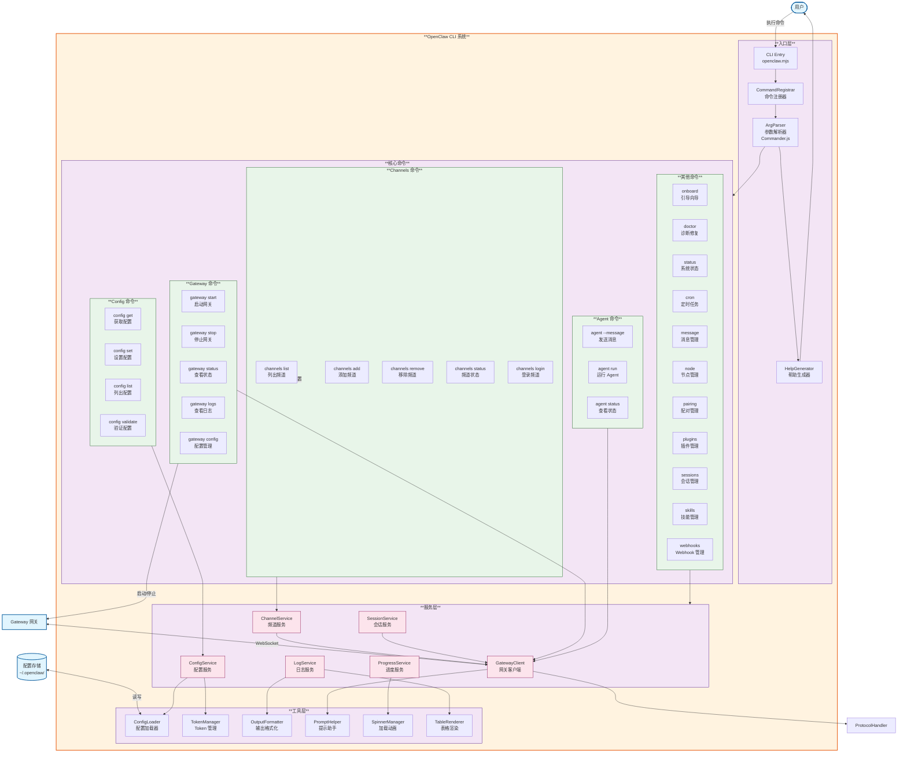

# OpenClaw C4 Model - Level 3: CLI Component Diagram

## CLI 组件图

## 组件说明

### 入口层 (Entry Layer)
- **CLI Entry**: CLI 入口点，处理启动逻辑
- **Command Registrar**: 注册所有可用的命令
- **Arg Parser**: 基于 Commander.js 解析命令行参数
- **Help Generator**: 生成帮助文档

### 核心命令 (Core Commands)

#### Gateway 命令
管理 Gateway 生命周期的命令组:
- `gateway start`: 启动 Gateway 服务
- `gateway stop`: 停止 Gateway 服务
- `gateway status`: 查看 Gateway 状态
- `gateway logs`: 查看 Gateway 日志
- `gateway config`: 管理 Gateway 配置

#### Agent 命令
与 Agent 交互的命令组:
- `agent --message`: 发送消息给 Agent
- `agent run`: 运行 Agent
- `agent status`: 查看 Agent 状态

#### Channels 命令
管理频道的命令组:
- `channels list`: 列出所有频道
- `channels add`: 添加新频道
- `channels remove`: 移除频道
- `channels status`: 查看频道状态
- `channels login`: 登录到频道

#### Config 命令
管理配置的命令组:
- `config get`: 获取配置值
- `config set`: 设置配置值
- `config list`: 列出所有配置
- `config validate`: 验证配置

#### 其他命令
- `onboard`: 引导向导，帮助新用户设置
- `doctor`: 诊断和修复系统问题
- `status`: 查看系统整体状态
- `cron`: 管理定时任务
- `message`: 发送和管理消息
- `node`: 管理节点
- `pairing`: 管理设备配对
- `plugins`: 管理插件
- `sessions`: 管理会话
- `skills`: 管理技能
- `webhooks`: 管理 Webhooks

### 服务层 (Service Layer)
- **GatewayClient**: 与 Gateway 建立 WebSocket 连接的客户端
- **ConfigService**: 配置管理服务，读写配置文件
- **ChannelService**: 频道服务，管理频道配置和状态
- **SessionService**: 会话服务，管理 CLI 会话
- **LogService**: 日志服务，处理和格式化日志输出
- **ProgressService**: 进度服务，显示长时间操作的进度

### 工具层 (Utility Layer)
- **ConfigLoader**: 配置加载器，从文件系统加载配置
- **TokenManager**: Token 管理，处理认证 Token
- **OutputFormatter**: 输出格式化，美化命令输出
- **PromptHelper**: 提示助手，交互式提示
- **SpinnerManager**: 加载动画管理
- **TableRenderer**: 表格渲染器，格式化表格输出
