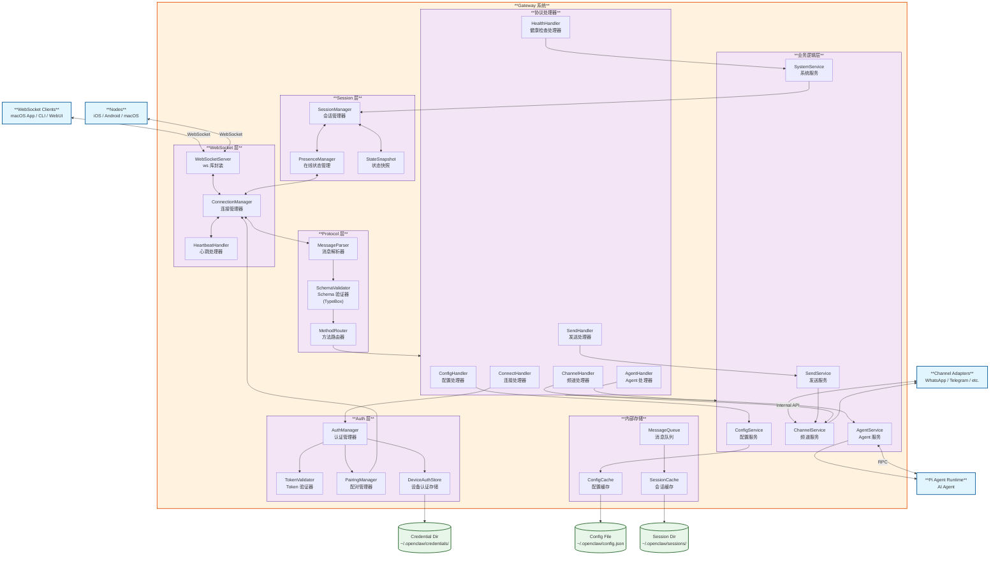

# OpenClaw C4 Model - Level 3: Gateway Component Diagram

## Gateway 组件图

## 组件说明

### 1. WebSocket 层 (WebSocket Layer)
- **WebSocketServer**: 基于 ws 库的 WebSocket 服务器，处理所有入站连接
- **ConnectionManager**: 管理客户端连接生命周期，维护连接状态表
- **HeartbeatHandler**: 处理心跳检测，检测断开的连接

### 2. 协议层 (Protocol Layer)
- **MessageParser**: 解析 JSON 消息，提取消息结构
- **SchemaValidator**: 使用 TypeBox 验证消息格式是否符合协议规范
- **MethodRouter**: 根据 method 字段路由到对应的协议处理器

### 3. 会话层 (Session Layer)
- **SessionManager**: 管理用户会话状态，包括会话创建、销毁、恢复
- **PresenceManager**: 管理在线状态，追踪用户活跃状态
- **StateSnapshot**: 维护和分发状态快照

### 4. 认证层 (Auth Layer)
- **AuthManager**: 认证管理器，协调认证流程
- **TokenValidator**: 验证 Token 有效性
- **PairingManager**: 处理设备配对流程
- **DeviceAuthStore**: 存储设备认证信息

### 5. 业务逻辑层 (Business Logic Layer)
- **AgentService**: Agent 服务，协调 AI Agent 调用
- **SendService**: 发送服务，处理消息发送逻辑
- **ChannelService**: 频道服务，管理频道连接和状态
- **ConfigService**: 配置服务，管理配置读写
- **SystemService**: 系统服务，提供系统级功能

### 6. 协议处理器 (Protocol Handlers)
- **ConnectHandler**: 处理连接请求
- **HealthHandler**: 处理健康检查
- **AgentHandler**: 处理 Agent 相关请求
- **SendHandler**: 处理发送消息请求
- **ConfigHandler**: 处理配置请求
- **ChannelHandler**: 处理频道相关请求

### 7. 数据存储
- **Config Cache**: 配置缓存，加速配置读取
- **Session Cache**: 会话缓存，维护会话状态
- **Message Queue**: 消息队列，异步处理消息
- **Config File**: 配置文件，持久化配置 (~/.openclaw/config.json)
- **Session Directory**: 会话目录，存储会话数据 (~/.openclaw/sessions/)
- **Credential Directory**: 凭证目录，存储认证凭证 (~/.openclaw/credentials/)
