# OpenClaw C4 Model - Level 3: Media Understanding Component Diagram

## Media Understanding 组件图

```mermaid
flowchart TB
    %% External Systems
    AudioInput["**音频输入**<br/>语音消息 / 音频文件"]
    STTProviders["**STT 提供商**<br/>Deepgram / Google / OpenAI"]
    LLMProviders["**LLM 提供商**<br/>Anthropic / OpenAI / Google"]

    %% Media Understanding System Boundary
    subgraph MediaUnderstanding["**媒体理解系统**<br/>Media Understanding"]
        direction TB

        %% Audio Processing Layer
        subgraph AudioLayer["**音频处理层**<br/>Audio Processing"]
            AudioRouter["AudioRouter<br/>音频路由器"]
            AudioValidator["AudioValidator<br/>音频验证器"]
            AudioPreprocessor["AudioPreprocessor<br/>音频预处理器"]
            AudioChunker["AudioChunker<br/>音频分块器"]
        end

        %% Diarization Layer (NEW)
        subgraph DiarizationLayer["**说话人分离层**<br/>Speaker Diarization (NEW)"]
            DiarizationEngine["DiarizationEngine<br/>说话人分离引擎"]
            VoiceprintExtractor["VoiceprintExtractor<br/>声纹特征提取器"]
            VoiceprintIdGenerator["VoiceprintIdGenerator<br/>声纹ID生成器"]
            SpeakerClustering["SpeakerClustering<br/>说话人聚类"]

            %% Parser Sub-layer
            subgraph ParserLayer["**解析器层**<br/>Provider Parsers"]
                DeepgramParser["DeepgramParser<br/>Deepgram解析器"]
                GoogleParser["GoogleParser<br/>Google解析器"]
            end
        end

        %% Transcription Layer
        subgraph TranscriptionLayer["**转录层**<br/>Transcription"]
            STTProviderRouter["STTProviderRouter<br/>STT提供商路由器"]
            TranscriptFormatter["TranscriptFormatter<br/>转录格式化器"]
            TranscriptMerger["TranscriptMerger<br/>转录合并器"]
        end

        %% Image/Video Processing Layer
        subgraph VisualLayer["**视觉处理层**<br/>Image/Video Processing"]
            ImageProcessor["ImageProcessor<br/>图像处理器"]
            VideoProcessor["VideoProcessor<br/>视频处理器"]
            VisionProviderRouter["VisionProviderRouter<br/>视觉提供商路由器"]
            VisualDescriptionFormatter["VisualDescriptionFormatter<br/>视觉描述格式化器"]
        end

        %% Speaker Management Layer
        subgraph SpeakerLayer["**说话人管理层**<br/>Speaker Management"]
            SpeakerRegistry["SpeakerRegistry<br/>说话人注册表"]
            SpeakerIdAssigner["SpeakerIdAssigner<br/>ID分配器"]
            SpeakerAliasManager["SpeakerAliasManager<br/>别名管理器"]
            SpeakerConsistencyChecker["SpeakerConsistencyChecker<br/>一致性检查器"]
        end

        %% Output Layer
        subgraph OutputLayer["**输出层**<br/>Output Processing"]
            OutputFormatter["OutputFormatter<br/>输出格式化器"]
            MediaUnderstandingOutput["MediaUnderstandingOutput<br/>媒体理解输出"]
            AgentIntegration["AgentIntegration<br/>Agent集成器"]
        end
    end

    %% Data Stores
    VoiceprintDB[("声纹数据库<br/>Voiceprint DB<br/>SQLite/File")]
    SpeakerAliasDB[("别名数据库<br/>Alias DB<br/>SQLite/File")]
    CacheStore[("缓存存储<br/>Cache Store<br/>Redis/Memory")]

    %% Connections - Input to Audio Layer
    AudioInput --> AudioValidator
    AudioValidator --> AudioPreprocessor
    AudioPreprocessor --> AudioChunker
    AudioChunker --> AudioRouter

    %% Connections - Audio Router to Diarization or Transcription
    AudioRouter -->|diarization=true| DiarizationEngine
    AudioRouter -->|diarization=false| STTProviderRouter

    %% Connections - Diarization Layer Internal
    DiarizationEngine --> VoiceprintExtractor
    DiarizationEngine --> DeepgramParser
    DiarizationEngine --> GoogleParser

    VoiceprintExtractor --> VoiceprintIdGenerator
    VoiceprintExtractor --> SpeakerClustering

    DeepgramParser --> STTProviders
    GoogleParser --> STTProviders

    SpeakerClustering --> SpeakerIdAssigner
    VoiceprintIdGenerator --> SpeakerIdAssigner

    %% Connections - Speaker Management
    SpeakerIdAssigner --> SpeakerRegistry
    SpeakerAliasManager --> SpeakerRegistry
    SpeakerRegistry --> SpeakerConsistencyChecker
    SpeakerAliasManager --> SpeakerAliasDB
    SpeakerRegistry --> VoiceprintDB

    %% Connections - Transcription Layer
    STTProviderRouter --> TranscriptFormatter
    TranscriptFormatter --> TranscriptMerger
    STTProviderRouter --> STTProviders

    %% Connections - Diarization to Transcription
    DiarizationEngine --> TranscriptFormatter
    TranscriptFormatter --> OutputFormatter

    %% Connections - Visual Layer
    ImageProcessor --> VisionProviderRouter
    VideoProcessor --> VisionProviderRouter
    VisionProviderRouter --> LLMProviders
    VisualDescriptionFormatter --> OutputFormatter

    %% Connections - Output Layer
    OutputFormatter --> MediaUnderstandingOutput
    MediaUnderstandingOutput --> AgentIntegration
    AgentIntegration --> PiAgent

    %% Connections - Caching
    DiarizationEngine --> CacheStore
    SpeakerRegistry --> CacheStore
    TranscriptFormatter --> CacheStore

    %% Style Definitions
    classDef external fill:#e1f5fe,stroke:#01579b,stroke-width:2px
    classDef audio fill:#fff3e0,stroke:#e65100,stroke-width:1px
    classDef diarization fill:#e8f5e9,stroke:#1b5e20,stroke-width:2px
    classDef transcription fill:#f3e5f5,stroke:#4a148c,stroke-width:1px
    classDef visual fill:#fce4ec,stroke:#880e4f,stroke-width:1px
    classDef speaker fill:#fff9c4,stroke:#f57f17,stroke-width:1px
    classDef output fill:#e0f7fa,stroke:#00838f,stroke-width:1px
    classDef storage fill:#eceff1,stroke:#37474f,stroke-width:2px

    class AudioInput,STTProviders,LLMProviders external
    class AudioLayer audio
    class DiarizationLayer diarization
    class ParserLayer diarization
    class TranscriptionLayer transcription
    class VisualLayer visual
    class SpeakerLayer speaker
    class OutputLayer output
    class VoiceprintDB,SpeakerAliasDB,CacheStore storage
```



## 组件说明

### 音频处理层 (Audio Processing Layer)

负责接收和预处理音频输入：

- **AudioValidator**: 验证音频格式、采样率、时长等
- **AudioPreprocessor**: 音频预处理，包括降噪、归一化、格式转换
- **AudioChunker**: 长音频分块处理，适配不同 STT 提供商限制
- **AudioRouter**: 音频路由器，根据配置决定处理流程（是否启用说话人分离）

### 说话人分离层 (Speaker Diarization Layer) ⭐ **NEW**

**新添加的核心组件层**，实现说话人分离功能：

#### 核心引擎

- **DiarizationEngine**: 说话人分离引擎，协调整个分离流程
- **VoiceprintExtractor**: 声纹特征提取器，从音频中提取 MFCC、x-vector 等特征
- **VoiceprintIdGenerator**: 声纹ID生成器，使用 SHA-256 生成确定性唯一ID
- **SpeakerClustering**: 说话人聚类，将相似声纹归为同一说话人

#### 提供商解析器

- **DeepgramParser**: 解析 Deepgram Nova-2 的 diarization 响应
- **GoogleParser**: 解析 Google Cloud STT 的 diarization 响应

### 转录层 (Transcription Layer)

负责语音识别和转录格式化：

- **STTProviderRouter**: STT 提供商路由器，选择最佳提供商
- **TranscriptFormatter**: 转录格式化器，格式化原始转录结果
- **TranscriptMerger**: 转录合并器，合并分块音频的转录结果

### 视觉处理层 (Image/Video Processing Layer)

处理图像和视频：

- **ImageProcessor**: 图像处理器，预处理图像
- **VideoProcessor**: 视频处理器，提取视频帧
- **VisionProviderRouter**: 视觉提供商路由器
- **VisualDescriptionFormatter**: 视觉描述格式化器

### 说话人管理层 (Speaker Management Layer) ⭐ **NEW**

**新添加的组件层**，管理说话人身份持久化和别名：

- **SpeakerRegistry**: 说话人注册表，存储和管理说话人信息
- **SpeakerIdAssigner**: ID 分配器，分配可读标识符
- **SpeakerAliasManager**: 别名管理器，管理用户自定义别名
- **SpeakerConsistencyChecker**: 一致性检查器，确保跨会话一致性

### 输出层 (Output Processing Layer)

整合和输出处理结果：

- **OutputFormatter**: 输出格式化器，整合所有处理结果
- **MediaUnderstandingOutput**: 媒体理解输出，结构化结果
- **AgentIntegration**: Agent 集成器，将结果传递给 Agent 运行时

### 数据存储 (Data Stores)

持久化存储系统：

- **VoiceprintDB**: 声纹数据库，存储声纹特征和ID映射
- **SpeakerAliasDB**: 别名数据库，存储用户自定义别名
- **CacheStore**: 缓存存储，加速重复查询

## 数据流

### 1. 带说话人分离的音频处理流程

```
音频输入
  ↓
AudioValidator (验证)
  ↓
AudioPreprocessor (预处理)
  ↓
AudioChunker (分块)
  ↓
AudioRouter (路由: diarization=true)
  ↓
DiarizationEngine (分离引擎)
  ├─→ DeepgramParser / GoogleParser (解析 STT 响应)
  ├─→ VoiceprintExtractor (提取声纹)
  ├─→ VoiceprintIdGenerator (生成 ID)
  ├─→ SpeakerClustering (聚类)
  ↓
SpeakerRegistry (注册说话人)
  ↓
TranscriptFormatter (格式化转录)
  ↓
OutputFormatter (格式化输出)
  ↓
AgentIntegration (传递给 Agent)
```

### 2. 无说话人分离的标准流程

```
音频输入
  ↓
AudioValidator (验证)
  ↓
AudioPreprocessor (预处理)
  ↓
AudioRouter (路由: diarization=false)
  ↓
STTProviderRouter (选择 STT 提供商)
  ↓
Deepgram / Google / OpenAI (转录)
  ↓
TranscriptFormatter (格式化)
  ↓
OutputFormatter (格式化输出)
  ↓
AgentIntegration (传递给 Agent)
```

## 配置说明

### 启用说话人分离

```yaml
tools:
  media:
    audio:
      enabled: true
      diarization: true # 启用说话人分离
      diarizationOptions:
        provider: deepgram # 提供商: deepgram 或 google
        model: nova-2 # 模型名称
        speakerCountMin: 1 # 最小说话人数
        speakerCountMax: 10 # 最大说话人数
        speakerLabelFormat: "Speaker {id}" # 说话人标签格式
        utterances: true # 启用话语分割
        forceVoiceprintIdForAllSpeakers: true # 强制为所有说话人生成ID
```

## 注意事项

### 性能考量

- **处理时间**: 说话人分离比标准转录需要更多处理时间（通常增加 20-50%）
- **内存使用**: 需要额外内存存储声纹特征和聚类数据
- **API 成本**: 启用 diarization 的 STT API 通常更昂贵

### 准确性考量

- **说话人数量**: 准确的说话人分离需要明确区分的声纹
- **音频质量**: 背景噪音、回声会影响分离准确性
- **语言支持**: 不同语言的分离准确性可能不同

### 隐私考量

- **声纹数据**: 声纹属于敏感生物特征数据，需要谨慎处理
- **数据存储**: 考虑声纹数据的存储、保留和删除策略
- **用户同意**: 建议在使用说话人分离前获得用户明确同意

## 相关文档

- [C4 Level 1: System Context](./level1-context.md)
- [C4 Level 2: Container](./level2-container.md)
- [Speaker Diarization C4 Model](./planning/speaker-diarization-c4.md)
- [Audio Processing Flow](./planning/audio-processing-flow.md)
- [Speaker Diarization Implementation](../../src/media-understanding/diarization/README.md)
