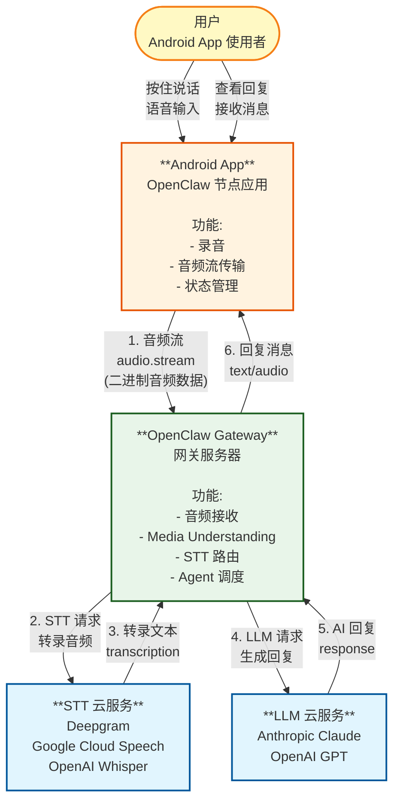
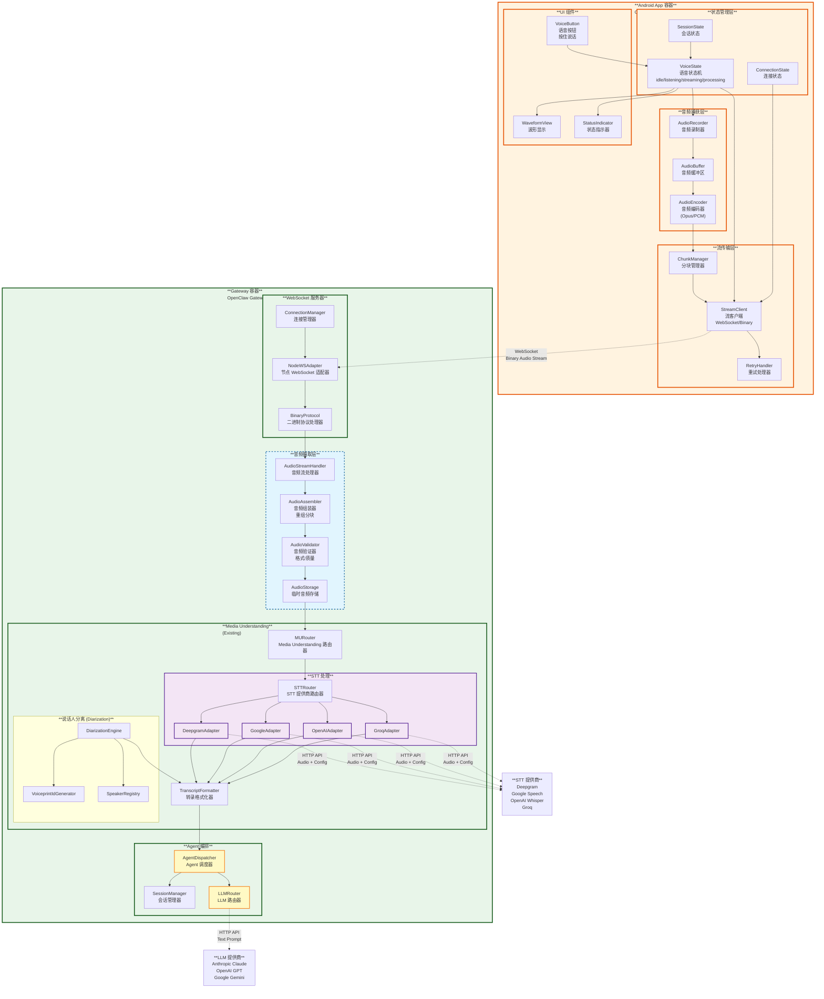
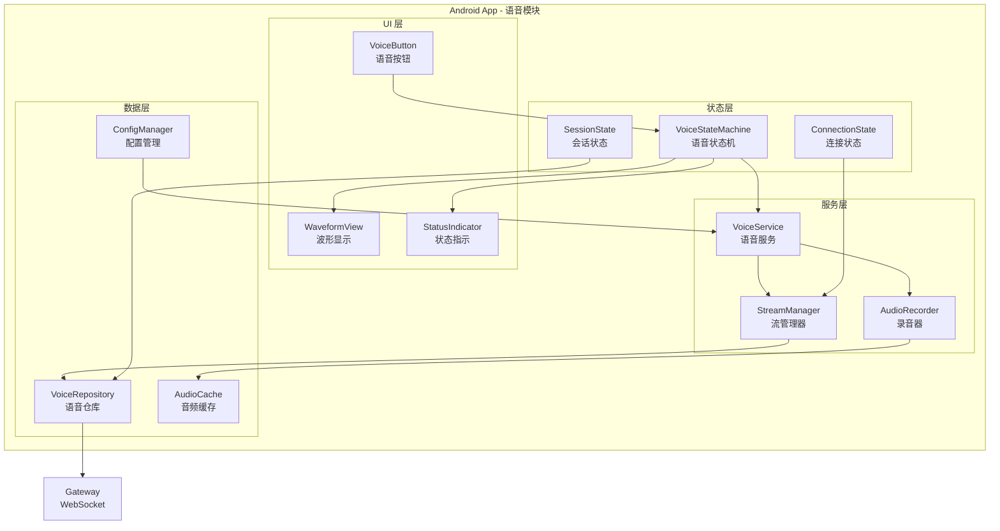
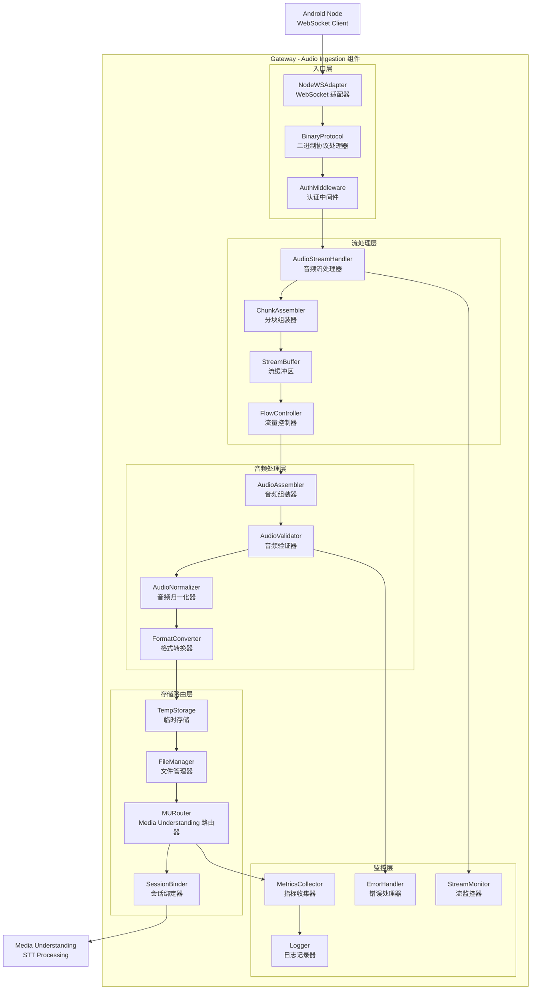
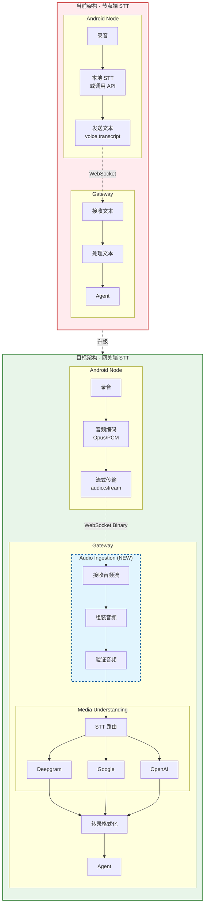

# Android Node Voice-to-Text Upgrade - C4 Model

## 升级概述

将安卓节点的语音转文字功能从**节点端处理**升级为**网关端统一处理**，与现有的 Media Understanding 系统保持一致架构。

### 当前架构 vs 目标架构

| 维度           | 当前架构 (节点端 STT)               | 目标架构 (网关端 STT)                |
| -------------- | ----------------------------------- | ------------------------------------ |
| **录音**       | Android 节点                        | Android 节点                         |
| **STT 处理**   | 节点本地或节点直接调用 API          | 网关 Media Understanding 系统        |
| **数据传输**   | 文本 (voice.transcript)             | 音频文件/数据 (audio.stream)         |
| **处理流程**   | 节点录音→节点转录→发送文本→网关处理 | 节点录音→发送音频→网关转录→Agent处理 |
| **架构一致性** | 与网关 Media Understanding 分离     | 统一使用 Media Understanding         |

---

## Level 1: System Context 系统上下文



### 系统上下文说明

**核心变化点**:

1. **数据传输从文本变为音频流** - Android App 不再本地转录，而是发送原始音频流到网关
2. **STT 处理集中到网关** - 统一使用 Media Understanding 系统，支持多提供商路由
3. **完整的请求-响应流程** - 音频 → STT → LLM → 回复，全链路在网关完成

---

## Level 2: Container 容器图



### 容器图说明

#### 主要变化点

**1. Android App 容器**

- **音频捕获层**: 负责录音和编码
- **流传输层**: 通过 WebSocket 发送二进制音频流（而非文本）
- **状态管理层**: 管理语音状态机（idle/listening/streaming/processing）

**2. Gateway 容器 - 新增 Audio Ingestion 层**

- **AudioStreamHandler**: 接收来自 Android 节点的二进制音频流
- **AudioAssembler**: 重组音频分块
- **AudioValidator**: 验证音频格式和质量
- **AudioStorage**: 临时存储音频文件

**3. Gateway 容器 - 复用 Media Understanding**

- 音频流入已存在的 Media Understanding 系统
- 通过 STTRouter 路由到不同 STT 提供商
- 支持 Deepgram、Google、OpenAI、Groq 等

#### 数据流对比

**当前架构 (节点端 STT)**:

```
录音 → 节点本地 STT → 文本 → voice.transcript → 网关 → Agent
```

**目标架构 (网关端 STT)**:

```
录音 → 音频流 → 网关 Audio Ingestion → Media Understanding → STT 提供商 → 文本 → Agent
```

---

## Level 3: Component 组件图

### 3.1 Android App 组件图



### 3.2 Gateway Audio Ingestion 组件图



### 3.3 完整升级流程组件图



---

## 升级关键设计决策

### 1. 协议设计

**新的 WebSocket 消息类型**:

```typescript
// 音频流开始
interface AudioStreamStart {
  type: "audio.stream.start";
  payload: {
    sessionKey: string;
    format: "opus" | "pcm" | "wav";
    sampleRate: number;
    channels: number;
    language?: string; // 可选语言提示
  };
}

// 音频数据块
interface AudioStreamChunk {
  type: "audio.stream.chunk";
  payload: {
    sequence: number;
    data: Uint8Array; // 二进制音频数据
    isLast: boolean;
  };
}

// 音频流结束
interface AudioStreamEnd {
  type: "audio.stream.end";
  payload: {
    totalChunks: number;
    totalBytes: number;
  };
}

// 转录结果（网关 → 节点）
interface TranscriptionResult {
  type: "audio.transcription";
  payload: {
    text: string;
    confidence?: number;
    language?: string;
    duration?: number;
    speakers?: SpeakerInfo[]; // 说话人分离结果
  };
}
```

### 2. 音频处理流程

```
┌─────────────────────────────────────────────────────────────────┐
│                     Android Node                                 │
├─────────────────────────────────────────────────────────────────┤
│  1. 录音 (AudioRecorder)                                        │
│     ↓                                                           │
│  2. 实时编码 (AudioEncoder - Opus/PCM)                         │
│     ↓                                                           │
│  3. 分块 (ChunkManager - 每块 20-100ms)                       │
│     ↓                                                           │
│  4. WebSocket 流式发送 (StreamClient)                           │
└─────────────────────────────────────────────────────────────────┘
                              ↓
┌─────────────────────────────────────────────────────────────────┐
│                     Gateway - Audio Ingestion                    │
├─────────────────────────────────────────────────────────────────┤
│  5. 接收音频流 (AudioStreamHandler)                             │
│     ↓                                                           │
│  6. 组装音频块 (AudioAssembler - 按 sequence 排序)              │
│     ↓                                                           │
│  7. 验证音频 (AudioValidator - 格式/大小/质量)                  │
│     ↓                                                           │
│  8. 临时存储 (TempStorage)                                       │
└─────────────────────────────────────────────────────────────────┘
                              ↓
┌─────────────────────────────────────────────────────────────────┐
│              Gateway - Media Understanding                       │
├─────────────────────────────────────────────────────────────────┤
│  9. 路由到 STT 提供商 (STTRouter)                                │
│     ↓                                                           │
│ 10. 调用 STT API (Deepgram/Google/OpenAI)                       │
│     ↓                                                           │
│ 11. 可选：说话人分离 (DiarizationEngine)                          │
│     ↓                                                           │
│ 12. 格式化转录结果 (TranscriptFormatter)                          │
└─────────────────────────────────────────────────────────────────┘
                              ↓
┌─────────────────────────────────────────────────────────────────┐
│                     Agent 处理                                    │
├─────────────────────────────────────────────────────────────────┤
│ 13. Agent 接收转录文本                                            │
│     ↓                                                           │
│ 14. Agent 生成回复                                               │
└─────────────────────────────────────────────────────────────────┘
```

### 3. 架构优势

| 优势               | 说明                                                                             |
| ------------------ | -------------------------------------------------------------------------------- |
| **统一架构**       | 与现有 Media Understanding 系统保持一致，复用 STT 路由、格式化、说话人分离等功能 |
| **多提供商支持**   | 自动支持 Deepgram、Google、OpenAI、Groq 等所有网关支持的 STT 提供商              |
| **高级功能**       | 自动获得说话人分离 (Diarization)、语言检测、自定义词汇等高级功能                 |
| **降低节点复杂度** | 节点只需实现录音和流传输，无需处理 STT 逻辑和提供商集成                          |
| **集中管理**       | 所有 STT 配置在网关统一管理，便于监控、日志、成本优化                            |
| **可扩展性**       | 新增 STT 提供商只需在网关实现，所有节点自动受益                                  |

---

## Level 3: Component 组件图

详见各个独立的组件图文档:

- [Android App 组件图](./level3-component-android-app.md) - 已有的 Android 组件文档
- [Media Understanding 组件图](./level3-component-media-understanding.md) - 已有的 Media Understanding 组件文档

### 新增组件说明

#### Gateway - Audio Ingestion 层组件

| 组件名                 | 职责                      | 关键接口                                                          |
| ---------------------- | ------------------------- | ----------------------------------------------------------------- |
| **AudioStreamHandler** | 处理 WebSocket 音频流消息 | `handleStreamStart()`, `handleStreamChunk()`, `handleStreamEnd()` |
| **AudioAssembler**     | 按 sequence 组装音频块    | `addChunk()`, `isComplete()`, `getAssembly()`                     |
| **AudioValidator**     | 验证音频格式、大小、质量  | `validateFormat()`, `validateSize()`, `validateQuality()`         |
| **AudioStorage**       | 临时存储音频文件          | `save()`, `load()`, `cleanup()`                                   |
| **StreamMonitor**      | 监控流状态和质量          | `trackProgress()`, `detectStall()`, `reportMetrics()`             |

---

## 实施路线图

### 阶段 1: 基础流传输 (MVP)

- [ ] 实现 `audio.stream.start/chunk/end` 消息协议
- [ ] 实现 AudioStreamHandler 基础接收功能
- [ ] 实现 AudioAssembler 基础组装功能
- [ ] Android App 实现录音和流传输
- [ ] 端到端测试：录音 → 流式传输 → 存储

### 阶段 2: 集成 Media Understanding

- [ ] AudioStorage 与 MURouter 集成
- [ ] 实现音频文件路由到 STT 提供商
- [ ] 复用现有 STT 适配器 (Deepgram, Google, OpenAI)
- [ ] 转录结果返回给 Agent
- [ ] 端到端测试：录音 → 转录 → Agent 处理

### 阶段 3: 高级功能

- [ ] 实现 AudioValidator 完整验证逻辑
- [ ] 支持多格式音频 (Opus, PCM, WAV)
- [ ] 集成说话人分离 (Diarization)
- [ ] 实现 StreamMonitor 监控和指标
- [ ] 性能优化和容错处理

### 阶段 4: 优化和扩展

- [ ] 支持实时流式 STT (流式转录)
- [ ] 实现音频压缩和优化
- [ ] 支持多语言检测
- [ ] 添加详细的日志和追踪
- [ ] 文档完善和开发者指南

---

## 附录

### A. 消息协议完整定义

```typescript
// 所有音频流消息的基础接口
interface AudioStreamMessage {
  type:
    | "audio.stream.start"
    | "audio.stream.chunk"
    | "audio.stream.end"
    | "audio.stream.ack"
    | "audio.stream.error"
    | "audio.transcription";
  timestamp: number;
  id: string;
}

// 音频流开始 - 客户端 → 网关
interface AudioStreamStartMessage extends AudioStreamMessage {
  type: "audio.stream.start";
  payload: {
    sessionKey: string;
    format: "opus" | "pcm" | "wav" | "aac";
    sampleRate: 8000 | 16000 | 24000 | 44100 | 48000;
    channels: 1 | 2;
    bitDepth?: 8 | 16 | 24 | 32;
    language?: string; // BCP-47 语言代码，如 'zh-CN', 'en-US'
    diarization?: boolean; // 是否启用说话人分离
    maxSpeakers?: number; // 最大说话人数
    keywords?: string[]; // 关键词提升识别率
  };
}

// 音频数据块 - 客户端 → 网关
interface AudioStreamChunkMessage extends AudioStreamMessage {
  type: "audio.stream.chunk";
  payload: {
    streamId: string; // 关联的 stream.start id
    sequence: number; // 序列号，用于顺序组装
    data: string; // Base64 编码的音频数据
    isLast: boolean; // 是否是最后一块
    timestamp?: number; // 该块的时间戳（毫秒）
  };
}

// 音频流结束 - 客户端 → 网关
interface AudioStreamEndMessage extends AudioStreamMessage {
  type: "audio.stream.end";
  payload: {
    streamId: string;
    totalChunks: number;
    totalBytes: number;
    duration?: number; // 音频时长（毫秒）
  };
}

// 音频流确认 - 网关 → 客户端
interface AudioStreamAckMessage extends AudioStreamMessage {
  type: "audio.stream.ack";
  payload: {
    streamId: string;
    receivedChunks: number;
    status: "receiving" | "processing" | "completed" | "error";
    progress?: number; // 处理进度 0-100
  };
}

// 音频流错误 - 网关 → 客户端
interface AudioStreamErrorMessage extends AudioStreamMessage {
  type: "audio.stream.error";
  payload: {
    streamId: string;
    code:
      | "INVALID_FORMAT"
      | "UNSUPPORTED_SAMPLE_RATE"
      | "STREAM_TIMEOUT"
      | "CHUNK_OUT_OF_ORDER"
      | "AUDIO_TOO_LARGE"
      | "STT_PROVIDER_ERROR"
      | "INTERNAL_ERROR";
    message: string;
    recoverable: boolean; // 是否可恢复
  };
}

// 转录结果 - 网关 → 客户端
interface TranscriptionResultMessage extends AudioStreamMessage {
  type: "audio.transcription";
  payload: {
    streamId: string;
    text: string;
    confidence?: number;
    language?: string;
    duration?: number;
    isFinal: boolean; // 是否是最终结果（流式 STT）
    speakers?: SpeakerInfo[];
    alternatives?: string[]; // 备选转录
    metadata?: {
      provider: string;
      model: string;
      processingTime: number;
    };
  };
}

interface SpeakerInfo {
  id: string;
  label?: string;
  startTime: number;
  endTime: number;
  confidence?: number;
}
```

### B. 配置示例

```yaml
# Android Node 配置
node:
  audio:
    capture:
      format: opus # 推荐 opus，压缩率高
      sampleRate: 16000
      channels: 1
      bitDepth: 16

    streaming:
      chunkSize: 4096 # 每块 4KB
      chunkInterval: 50 # 每 50ms 发送一块
      retryAttempts: 3
      timeout: 30000

    compression:
      enabled: true
      algorithm: opus
      bitrate: 24000 # 24kbps

# Gateway 配置
gateway:
  audioIngestion:
    enabled: true
    maxStreamSize: 104857600 # 100MB
    maxDuration: 300000 # 5分钟
    supportedFormats: ["opus", "pcm", "wav", "aac"]

    streamProcessing:
      chunkTimeout: 10000
      assemblyTimeout: 30000
      validationEnabled: true

    storage:
      type: "temp" # temp/local/s3
      ttl: 3600 # 1小时
      cleanupInterval: 600

  mediaUnderstanding:
    audio:
      enabled: true
      diarization: true

      providers:
        primary: "deepgram"
        fallback: ["google", "openai"]

        deepgram:
          model: "nova-2"
          features:
            - "diarization"
            - "punctuation"
            - "utterances"

        google:
          model: "latest_long"
          useEnhanced: true

        openai:
          model: "whisper-1"
```

---

## 总结

本文档提供了将 Android 节点语音转文字功能从**节点端处理**升级为**网关端统一处理**的完整 C4 模型设计。

### 核心变化

1. **数据传输从文本变为音频流** - 使用 WebSocket 二进制流传输原始音频
2. **复用现有 Media Understanding 系统** - 自动获得多 STT 提供商支持
3. **节点复杂度降低** - 只需实现录音和流传输，无需处理 STT 逻辑

### 主要新增组件

- **Gateway Audio Ingestion 层** - 接收、组装、验证音频流
- **Android Node 流传输层** - 录音、编码、分块、流传输
- **新的 WebSocket 协议** - `audio.stream.start/chunk/end` 消息类型

### 实施建议

1. **渐进式升级** - 先实现基础流传输，再集成 Media Understanding
2. **向后兼容** - 保留现有的 `voice.transcript` 协议作为降级方案
3. **性能优化** - 使用 Opus 编码、合理分块大小、流式处理
4. **监控完善** - 添加详细的流处理指标和错误追踪

这个设计使 Android 节点与网关的其他 Channel 适配器（如 WhatsApp、Telegram）保持一致，都通过统一的 Media Understanding 系统处理音频转录。
