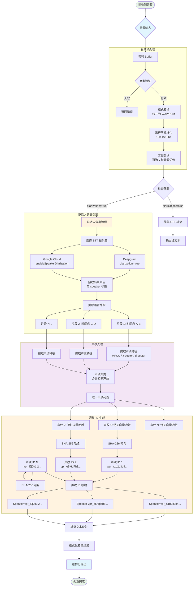
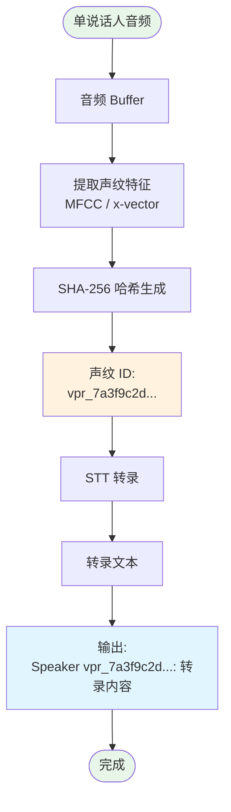
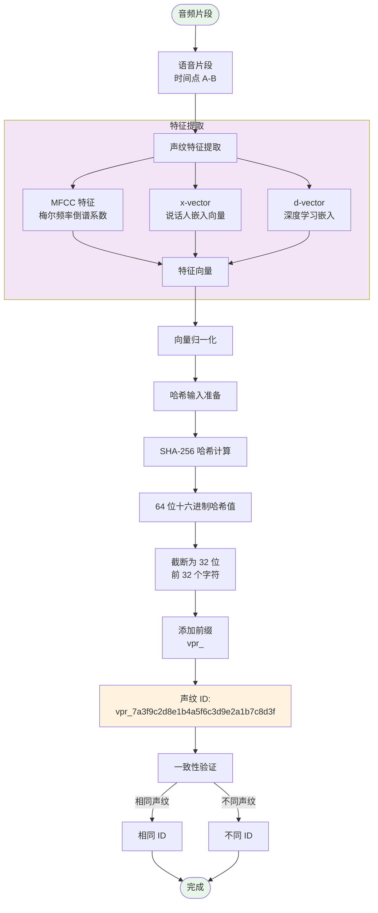
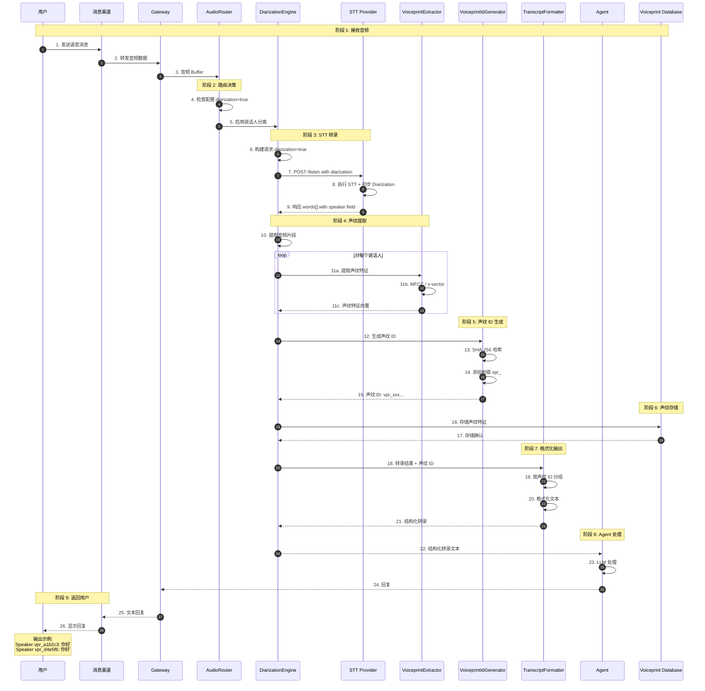
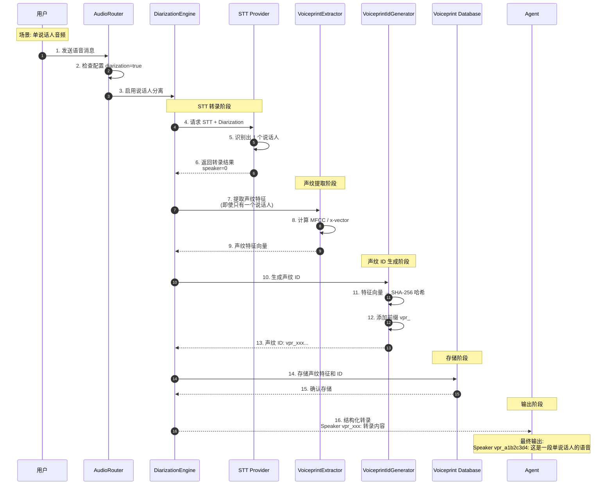
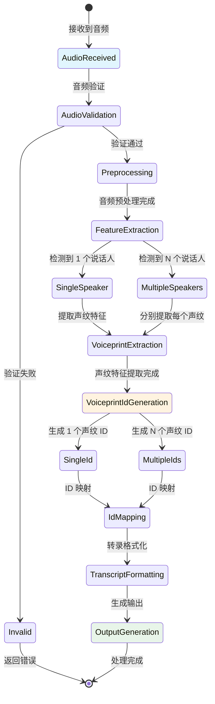
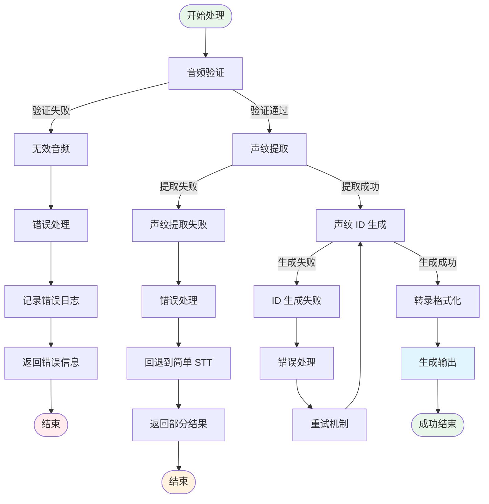

# 音频处理详细流程图和时序图

本文档详细描述 OpenClaw 接收到音频后的完整处理流程，包括流程图和时序图。

## 核心原则

**无论语音中有几个说话人（包括只有一个人），都必须给每个声纹打上唯一的、确定性的 ID。**

---

## 1. 音频处理总流程图



---

## 2. 单说话人场景处理流程图



---

## 3. 声纹 ID 生成详细流程图



---

## 4. 完整时序图



---

## 5. 单说话人场景时序图



---

## 6. 声纹 ID 生成详细流程图

```mermaid
flowchart TB
    Start([音频片段]) --> AudioSegment[语音片段<br/>时间点 A-B]
    
    AudioSegment --> Preprocessing[音频预处理]
    
    subgraph AudioPreprocessing[音频预处理]
        Preprocessing --> Resampling[重采样<br/>16kHz]
        Resampling --> Preemphasis[预加重<br/>高频增强]
        Preemphasis --> Framing[分帧<br/>25ms 帧长]
        Framing --> Windowing[加窗<br/>汉明窗]
    end
    
    Windowing --> FeatureExtraction[特征提取]
    
    subgraph FeatureExtraction[特征提取层]
        FeatureExtraction --> MFCC[MFCC 特征<br/>梅尔频率倒谱系数]
        FeatureExtraction --> Delta[Delta 特征<br/>一阶差分]
        FeatureExtraction --> Delta2[Delta-Delta<br/>二阶差分]
        FeatureExtraction --> XVector[x-vector<br/>深度说话人嵌入]
        
        MFCC --> FeatureVector[特征向量拼接]
        Delta --> FeatureVector
        Delta2 --> FeatureVector
        XVector --> FeatureVector
    end
    
    FeatureVector --> Normalization[特征归一化]
    
    Normalization --> L2Norm[L2 归一化]
    
    L2Norm --> HashInput[哈希输入准备]
    
    HashInput --> BinarySerialization[二进制序列化]
    
    BinarySerialization --> SHA256[SHA-256 哈希计算]
    
    SHA256 --> HashOutput[64 位十六进制哈希值]
    
    HashOutput --> Truncate[截断为 32 位<br/>前 32 个字符]
    
    Truncate --> AddPrefix[添加前缀<br/>vpr_]
    
    AddPrefix --> VoiceprintId["声纹 ID:<br/>vpr_7a3f9c2d8e1b4a5f6c3d9e2a1b7c8d3f"]
    
    VoiceprintId --> Verification[一致性验证]
    
    Verification -->|相同声纹| SameId[相同 ID<br/>确定性保证]
    Verification -->|不同声纹| DiffId[不同 ID<br/>唯一性保证]
    
    SameId --> End([完成])
    DiffId --> End
    
    style Start fill:#e8f5e9
    style End fill:#e8f5e9
    style VoiceprintId fill:#fff3e0
    style FeatureExtraction fill:#f3e5f5
    style AudioPreprocessing fill:#e1f5fe
```

---

## 7. 状态转换图



---

## 8. 关键处理逻辑说明

### 8.1 单说话人处理逻辑

```
当检测到只有一个说话人时：

1. 仍然执行完整的声纹提取流程
2. 计算该说话人的声纹特征向量
3. 使用 SHA-256 生成唯一的声纹 ID
4. 输出格式："Speaker vpr_xxx: 转录内容"

注意：即使只有一个人说话，也要打 ID！
```

### 8.2 多说话人处理逻辑

```
当检测到多个说话人时：

1. 分别提取每个说话人的声纹特征
2. 对每个声纹计算 SHA-256 哈希
3. 为每个说话人生成唯一的声纹 ID
4. 按时间顺序组织对话
5. 输出格式：
   "Speaker vpr_xxx: 说话人 A 的内容"
   "Speaker vpr_yyy: 说话人 B 的内容"
```

### 8.3 声纹 ID 确定性保证

```
声纹 ID 生成算法：

输入：声纹特征向量 V = [v1, v2, v3, ..., vn]
步骤 1: 向量归一化 V' = V / ||V||
步骤 2: 二进制序列化 B = serialize(V')
步骤 3: SHA-256 哈希 H = sha256(B)
步骤 4: 取前 32 位 H32 = H[0:32]
步骤 5: 添加前缀 ID = "vpr_" + H32

输出：确定性声纹 ID

特性：
- 相同声纹 → 相同特征向量 → 相同哈希 → 相同 ID
- 不同声纹 → 不同特征向量 → 不同哈希 → 不同 ID
- 跨平台一致：使用相同算法，相同声纹一定得到相同 ID
```

---

## 9. 错误处理流程



---

## 10. 配置示例

```yaml
# 完整配置示例
tools:
  media:
    audio:
      enabled: true
      diarization: true
      diarizationOptions:
        provider: deepgram
        model: nova-2
        # 关键配置：即使只有一个说话人，也强制生成声纹 ID
        speakerCountMin: 1  # 设置为1，确保单说话人也处理
        speakerCountMax: 10
        # 强制为所有说话人生成声纹 ID（包括单说话人场景）
        forceVoiceprintIdForAllSpeakers: true
        speakerLabelFormat: "Speaker {id}"
        utterances: true
      
      # 声纹 ID 生成配置
      voiceprintIdGeneration:
        algorithm: sha256
        vectorNormalization: l2
        outputFormat: "vpr_{hash}"
        hashTruncation: 32  # 取前32位
      
      # 声纹数据库配置
      voiceprintDatabase:
        enabled: true
        storage: sqlite
        tableName: voiceprints
        indexByHash: true
      
      # 错误处理配置
      errorHandling:
        fallbackToSimpleSTT: true
        retryAttempts: 3
        logErrors: true
```

---

## 总结

本文档详细描述了 OpenClaw 接收到音频后的完整处理流程，包括：

1. **流程图**: 从音频接收到最终输出的完整流程
2. **单说话人处理**: 详细说明即使只有一个说话人也要打 ID
3. **声纹 ID 生成**: 详细的声纹特征提取和 ID 生成流程
4. **时序图**: 完整的时序交互图
5. **状态图**: 音频处理的状态转换
6. **错误处理**: 完整的错误处理流程

**核心原则强调**：
- ✅ 无论语音中有几个说话人（包括只有一个人），都必须给每个声纹打上唯一的、确定性的 ID
- ✅ 使用相同的算法在任何地方生成的 ID 必须相同（只要声纹相同）
- ✅ ID 必须与声纹特征强相关
