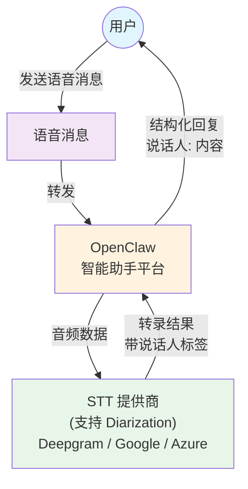
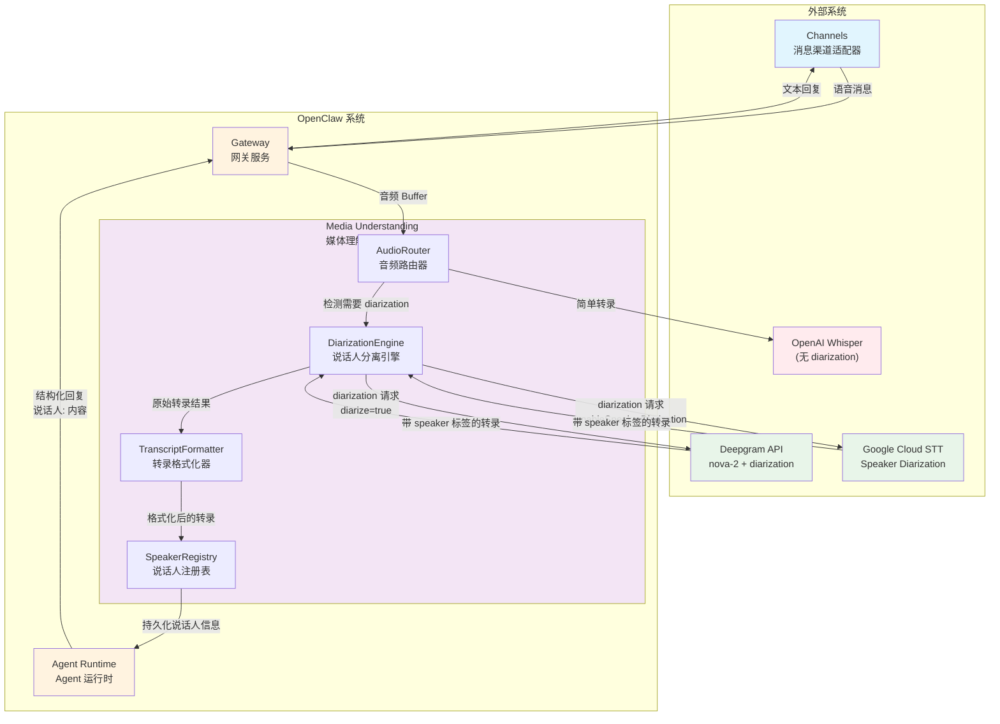
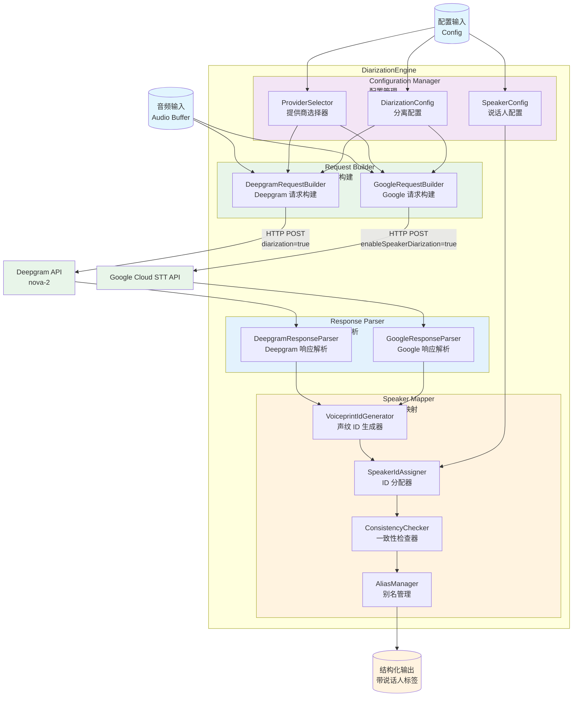
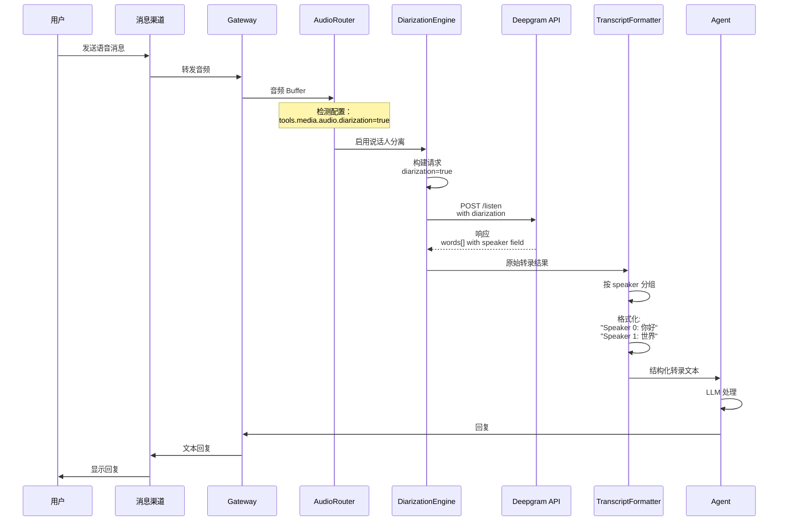

# Speaker Diarization C4 Model

本文档使用 C4 Model 方法描述 OpenClaw 中实现说话人分离 (Speaker Diarization) 的架构设计。

## 概述

说话人分离（Speaker Diarization）是指在音频转录过程中识别"谁在说话"的能力。这对于多说话人场景（如会议、采访、对话）非常重要。

### 当前状态

目前 OpenClaw 的语音转文本 (STT) 只能输出纯文本，无法区分不同说话人。

### 目标

通过集成支持说话人分离的 STT 提供商（如 Deepgram、Google Cloud Speech-to-Text）来实现说话人分离功能。

---

## Level 1: System Context (系统上下文图)



### 系统上下文说明

1. **用户 (User)**: 发送语音消息的最终用户
2. **语音消息 (VoiceMessage)**: 来自 WhatsApp、Telegram、Slack 等渠道的语音消息
3. **OpenClaw**: 智能助手平台，负责处理语音消息并返回结构化回复
4. **STT 提供商**: 支持说话人分离的语音识别服务（如 Deepgram Nova-2、Google Cloud Speech-to-Text）

---

## Level 2: Container (容器图)



### 容器说明

#### Media Understanding 容器 (媒体理解)

专门处理媒体内容（音频、视频、图像）的容器，新增说话人分离功能：

1. **AudioRouter** (音频路由器)
   - 决定音频路由：简单转录 vs 说话人分离
   - 根据配置选择 STT 提供商

2. **DiarizationEngine** (说话人分离引擎)
   - 核心组件，调用支持 diarization 的 STT API
   - 处理 Deepgram 和 Google Cloud 的 diarization 响应

3. **TranscriptFormatter** (转录格式化器)
   - 将原始转录结果格式化为结构化文本
   - 生成 "说话人 A: 内容" 格式

4. **SpeakerRegistry** (说话人注册表)
   - 管理说话人标识（如 Speaker 0, Speaker 1）
   - 支持说话人持久化（可选的声纹识别扩展）

---

## Level 3: Component (组件图)

### DiarizationEngine 详细组件图



### 组件详细说明

#### 1. Configuration Manager (配置管理)

**ProviderSelector** (提供商选择器)
- 根据配置选择 STT 提供商 (Deepgram vs Google)
- 优先级: 用户配置 > 系统默认
- 考虑因素: 成本、准确度、延迟、支持的语言

**DiarizationConfig** (分离配置)
- 配置说话人分离参数
- Deepgram: `diarization=true`, `diarization_version=2021-07-14.0`
- Google: `enableSpeakerDiarization=true`, `diarizationSpeakerCountMin/Max`

**SpeakerConfig** (说话人配置)
- 说话人标识格式 (Speaker 0, Speaker 1 或 Person A, Person B)
- 最大说话人数限制
- 声纹识别开关 (可选的高级功能)

#### 2. Request Builder (请求构建)

**DeepgramRequestBuilder**
```javascript
{
  "model": "nova-2",
  "diarization": true,
  "diarization_version": "2021-07-14.0",
  "smart_format": true,
  "utterances": true  // 启用话语分割
}
```

**GoogleRequestBuilder**
```javascript
{
  "config": {
    "enableSpeakerDiarization": true,
    "diarizationSpeakerCountMin": 2,
    "diarizationSpeakerCountMax": 6,
    "model": "latest_long"
  }
}
```

#### 3. Response Parser (响应解析)

**DeepgramResponseParser**
解析 Deepgram 响应中的 `speaker` 字段:
```javascript
{
  "results": {
    "channels": [{
      "alternatives": [{
        "transcript": "你好世界",
        "words": [
          {"word": "你好", "speaker": 0, "start": 0.0, "end": 0.5},
          {"word": "世界", "speaker": 1, "start": 0.6, "end": 1.0}
        ]
      }]
    }]
  }
}
```

**GoogleResponseParser**
解析 Google Cloud STT 的 `speakerTag`:
```javascript
{
  "results": [{
    "alternatives": [{
      "transcript": "你好世界",
      "words": [
        {"word": "你好", "speakerTag": 1},
        {"word": "世界", "speakerTag": 2}
      ]
    }]
  }]
}
```

#### 4. Speaker Mapper (说话人映射)

**VoiceprintIdGenerator** (声纹 ID 生成器 - 核心组件)
- **核心职责**: 从音频特征生成**确定性、唯一性**的说话人 ID
- **关键约束**: 
  - ID 必须与声纹特征强相关
  - 每个声纹必须有一个且仅有一个唯一的 ID 与之关联
  - 使用相同的算法在任何地方生成的 ID 必须相同（只要声纹相同）
- **ID 生成算法**: 使用声纹特征的哈希值作为 ID
  - 提取音频的声纹特征向量 (Voiceprint Features)
  - 使用 SHA-256 等确定性哈希算法生成 ID
  - 相同声纹 → 相同特征向量 → 相同哈希值 → 相同 ID
- **跨平台一致性**: 只要使用相同的特征提取算法和哈希算法，在任何地方生成的 ID 都相同
- **示例 ID 格式**: `vpr_7a3f9c2d8e1b4a5f6c3d9e2a1b7c8d3f` (基于声纹哈希)

**SpeakerIdAssigner** (ID 分配器)
- 接收 VoiceprintIdGenerator 生成的确定性 ID
- 将 ID 映射为可读的显示名称
- 格式选项:
  - `Speaker {id}` (默认)
  - `Person {letter}`
  - `说话人 {id}` (中文)
  - 用户自定义别名 (从 AliasManager 获取)

**ConsistencyChecker** (一致性检查器)
- 确保相同声纹在不同会话中保持一致的 ID
- **实现方式**: 使用 VoiceprintIdGenerator 的确定性 ID，天然保证跨会话一致性
- 可选: 维护声纹 ID 到元数据的映射表 (创建时间、最后出现时间、出现次数等)
- **声纹数据库**: 存储声纹特征向量与 ID 的映射，用于快速查找和验证

**AliasManager** (别名管理)
- 允许用户为声纹 ID 分配自定义名称
- 支持手动映射和自动记忆
- **持久化**: 将声纹 ID → 别名的映射存储在数据库中
- **示例映射**:
  - `vpr_7a3f9c2d...` → "张三"
  - `vpr_3e8a1b5c...` → "李四"
- **API 接口**: 提供管理别名的接口 (创建、更新、删除、查询)

---

## 数据流图



---

## 配置示例

### 1. 启用说话人分离 (Deepgram)

```yaml
# config.yaml
tools:
  media:
    audio:
      enabled: true
      diarization: true
      diarizationOptions:
        provider: deepgram
        model: nova-2
        speakerCountMin: 2
        speakerCountMax: 6
        speakerLabelFormat: "Speaker {id}"  # 选项: "Person {letter}", "说话人 {id}"
        utterances: true  # 启用话语分割
```

### 2. Google Cloud STT 配置

```yaml
tools:
  media:
    audio:
      enabled: true
      diarization: true
      diarizationOptions:
        provider: google
        model: latest_long
        speakerCountMin: 2
        speakerCountMax: 6
        enableWordTimeOffsets: true
```

### 3. 高级配置：声纹识别（未来扩展）

```yaml
tools:
  media:
    audio:
      diarization: true
      speakerIdentification:
        enabled: true
        method: voiceprint  # 或 "clustering"
        persistence: true  # 跨会话保持说话人 ID
        aliasMapping:
          "speaker_0": "张三"
          "speaker_1": "李四"
```

---

## 输出格式示例

### 标准格式

```
[Audio - 2 speakers detected]

Speaker 0: 大家好，欢迎来到今天的会议。
Speaker 1: 谢谢主持人，我是来自销售部的李明。
Speaker 0: 好的李明，请介绍一下上个月的业绩。
Speaker 1: 好的，上个月我们的销售额增长了 20%...
```

### 带时间戳格式

```
[Audio - 2 speakers detected]

[00:00:02] Speaker 0: 大家好
[00:00:04] Speaker 1: 你好
[00:00:06] Speaker 0: 我们开始吧
```

---

## 实施路线图

### 阶段 1: 基础 Diarization 支持 (MVP)

1. **修改现有 Provider**
   - 更新 Deepgram provider 支持 `diarization` 参数
   - 更新 Google provider 支持 `enableSpeakerDiarization` 参数

2. **添加 DiarizationEngine 组件**
   - 创建 `DiarizationEngine` 类
   - 实现请求构建和响应解析

3. **修改 TranscriptFormatter**
   - 支持按 speaker 分组
   - 生成格式化的转录文本

4. **配置更新**
   - 添加 `tools.media.audio.diarization` 配置项
   - 支持提供商特定的配置选项

### 阶段 2: 增强功能

1. **话语分割 (Utterance Segmentation)**
   - 支持按说话轮次分割
   - 添加时间戳

2. **说话人数量检测**
   - 自动检测说话人数量
   - 支持最小/最大说话人数量配置

3. **格式选项**
   - 支持多种输出格式（带时间戳、纯文本等）

### 阶段 3: 高级功能 (未来)

1. **说话人识别 (Speaker Identification)**
   - 使用声纹特征识别特定说话人
   - 支持说话人别名映射

2. **跨会话一致性**
   - 跨多个会话保持说话人 ID 一致性
   - 声纹数据库

3. **实时 Diarization**
   - 支持流式音频的实时说话人分离

---

## 技术细节

### 支持的 STT 提供商 Diarization 特性对比

| 特性 | Deepgram Nova-2 | Google Cloud STT | Azure Speech |
|------|----------------|------------------|--------------|
| Diarization | ✅ | ✅ | ✅ |
| 说话人数量检测 | ✅ | ✅ | ✅ |
| 话语分割 | ✅ | ✅ | ✅ |
| 时间戳 | ✅ | ✅ | ✅ |
| 置信度分数 | ✅ | ✅ | ✅ |
| 多语言 | ✅ | ✅ | ✅ |

### Deepgram Diarization 响应格式

```json
{
  "results": {
    "channels": [{
      "alternatives": [{
        "transcript": "complete transcript here",
        "words": [
          {
            "word": "hello",
            "start": 0.0,
            "end": 0.5,
            "speaker": 0,
            "confidence": 0.95
          }
        ],
        "paragraphs": {
          "transcript": "transcript with paragraphs",
          "paragraphs": [{
            "sentences": [{
              "text": "sentence text",
              "start": 0.0,
              "end": 1.0
            }],
            "speaker": 0,
            "num_words": 10
          }]
        }
      }]
    }]
  }
}
```

### Google Cloud STT Diarization 响应格式

```json
{
  "results": [{
    "alternatives": [{
      "transcript": "complete transcript",
      "words": [
        {
          "word": "hello",
          "startTime": {"seconds": 0, "nanos": 0},
          "endTime": {"seconds": 1, "nanos": 0},
          "speakerTag": 1
        }
      ]
    }],
    "resultEndTime": {"seconds": 10, "nanos": 0},
    "alternatives": [{
      "transcript": "alternative",
      "confidence": 0.95,
      "words": [...]
    }]
  }]
}
```

---

## 实现注意事项

### 1. 向后兼容性

- `diarization` 配置默认为 `false`，确保向后兼容
- 当 `diarization: false` 或不存在时，使用现有的简单转录流程

### 2. 错误处理

- 如果 diarization 失败，回退到简单转录（不带说话人标签）
- 记录详细的错误日志用于调试

### 3. 性能考虑

- Diarization 比简单转录需要更多处理时间
- 考虑添加超时配置
- 长音频文件可能需要分块处理

### 4. 成本考虑

- 带 diarization 的 STT 通常比简单转录更贵
- 提供配置选项让用户在成本和功能之间权衡

### 5. 隐私和合规

- 声纹数据属于敏感个人信息
- 需要明确的用户同意
- 考虑数据存储和保留策略

---

## 测试策略

### 1. 单元测试

- 测试 DiarizationEngine 的请求构建
- 测试 ResponseParser 的正确解析
- 测试 SpeakerRegistry 的 ID 分配

### 2. 集成测试

- 使用真实音频文件测试 Deepgram 集成
- 测试不同说话人数量的音频
- 测试边界情况（单说话人、噪音等）

### 3. 端到端测试

- 完整的语音消息处理流程
- 验证输出格式正确性
- 性能基准测试

---

## 相关文件

- `src/media-understanding/runner.ts` - 媒体理解主运行器
- `src/media-understanding/providers/deepgram/audio.ts` - Deepgram 提供商
- `src/media-understanding/providers/google/audio.ts` - Google 提供商
- `src/media-understanding/types.ts` - 类型定义
- `src/media-understanding/format.ts` - 格式化工具

---

## 参考链接

- [Deepgram Diarization Documentation](https://developers.deepgram.com/docs/diarization)
- [Google Cloud STT Speaker Diarization](https://cloud.google.com/speech-to-text/docs/multiple-voices)
- [Azure Speech Speaker Recognition](https://docs.microsoft.com/en-us/azure/cognitive-services/speech-service/speaker-recognition-overview)
- [C4 Model](https://c4model.com/)

---

*最后更新: 2025年*
